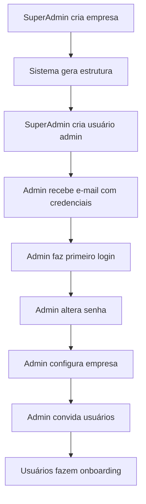
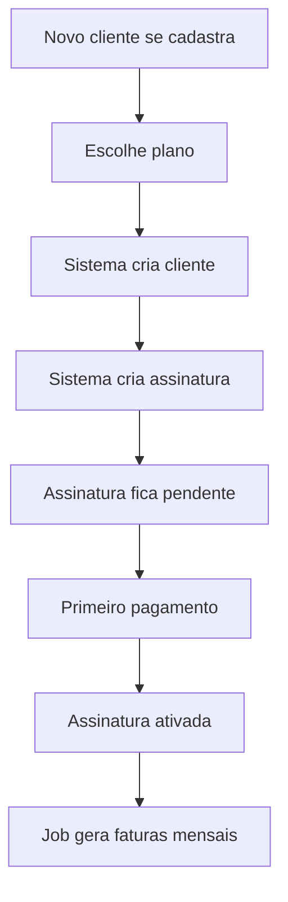
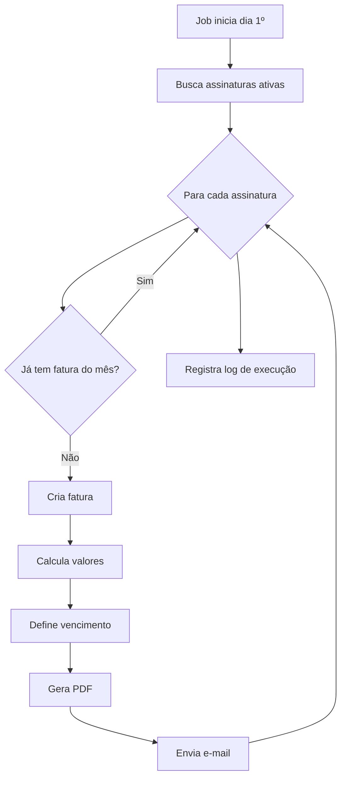
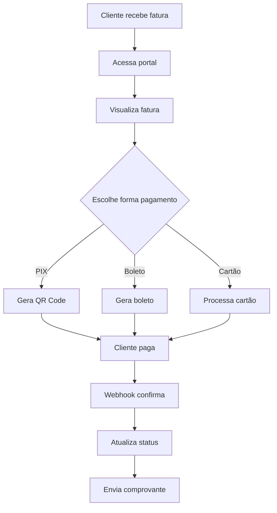

# 📘 Documentação Funcional do Sistema
## Partnership Manager - Plataforma de Gestão Societária e Faturamento

**Versão:** 1.0.0  
**Data de Atualização:** 23 de Janeiro de 2026  
**Status:** Em Desenvolvimento

---

## 📑 Índice

1. [Visão Geral do Sistema](#visão-geral-do-sistema)
2. [Módulos Implementados](#módulos-implementados)
3. [Perfis de Usuários](#perfis-de-usuários)
4. [Funcionalidades Detalhadas](#funcionalidades-detalhadas)
5. [Fluxos de Trabalho](#fluxos-de-trabalho)
6. [Regras de Negócio](#regras-de-negócio)
7. [Integrações](#integrações)
8. [Relatórios e Métricas](#relatórios-e-métricas)
9. [Roadmap](#roadmap)

---

## 🎯 Visão Geral do Sistema

### Propósito

O **Partnership Manager** é uma plataforma SaaS desenvolvida para empresas que precisam gerenciar:
- **Gestão Societária**: Cap Table, sócios, ações e participações
- **Faturamento**: Clientes, planos, assinaturas e faturas
- **Usuários e Permissões**: Controle de acesso baseado em funções
- **Auditoria**: Rastreamento completo de todas as ações

### Público-Alvo

- **Empresas de capital fechado** que precisam gerenciar sócios e participações
- **Startups** com necessidade de controle de equity e vesting
- **Software Houses** que prestam serviços de gestão empresarial
- **Investidores e Fundos** que acompanham múltiplas empresas

### Características Principais

✅ **Multi-empresa**: Uma instalação gerencia múltiplas empresas  
✅ **Multi-tenant**: Isolamento total de dados entre empresas  
✅ **Autenticação Segura**: JWT com refresh token e bloqueio automático  
✅ **Auditoria Completa**: Rastreamento de todas as operações  
✅ **API REST**: Integração com sistemas externos  
✅ **Cache Distribuído**: Performance otimizada com Redis  
✅ **Jobs Automatizados**: Processamento em background com Hangfire  

---

## 🧩 Módulos Implementados

### Status de Implementação

| Módulo | Status | Completude |
|--------|--------|------------|
| **Core - Empresas** | ✅ Implementado | 100% |
| **Core - Usuários** | ✅ Implementado | 100% |
| **Autenticação** | ✅ Implementado | 100% |
| **Billing - Clientes** | ✅ Implementado | 100% |
| **Billing - Planos** | ✅ Implementado | 100% |
| **Billing - Assinaturas** | ✅ Implementado | 100% |
| **Billing - Faturas** | ✅ Implementado | 90% |
| **Auditoria** | ✅ Implementado | 100% |
| **Sócios/Acionistas** | 🚧 Planejado | 0% |
| **Cap Table** | 🚧 Planejado | 0% |
| **Vesting** | 🚧 Planejado | 0% |
| **Contratos** | 🚧 Planejado | 0% |
| **Portal do Investidor** | 🚧 Planejado | 0% |

---

## 👥 Perfis de Usuários

### 1. Super Admin (SuperAdmin)

**Escopo:** Acesso global ao sistema

**Permissões:**
- ✅ Criar, editar e excluir empresas
- ✅ Gerenciar todos os usuários de todas as empresas
- ✅ Acessar dados de qualquer empresa
- ✅ Configurar sistema e parâmetros globais
- ✅ Visualizar logs de auditoria completos
- ✅ Gerenciar módulo de billing (todos os clientes)

**Casos de Uso:**
- Instalação e configuração inicial do sistema
- Onboarding de novas empresas clientes
- Suporte técnico avançado
- Monitoramento de saúde do sistema

---

### 2. Administrador (Admin)

**Escopo:** Acesso completo dentro da sua empresa

**Permissões:**
- ✅ Gerenciar informações da empresa
- ✅ Criar, editar e excluir usuários da empresa
- ✅ Atribuir funções e permissões
- ✅ Gerenciar sócios e acionistas
- ✅ Gerenciar cap table e vesting
- ✅ Visualizar todos os relatórios
- ✅ Acessar logs de auditoria da empresa
- ❌ Não pode acessar dados de outras empresas

**Casos de Uso:**
- Gestão diária da empresa no sistema
- Onboarding de novos colaboradores
- Configuração de regras de vesting
- Emissão de relatórios gerenciais

---

### 3. Gerente (Manager)

**Escopo:** Acesso operacional limitado

**Permissões:**
- ✅ Visualizar informações da empresa
- ✅ Criar e editar sócios
- ✅ Visualizar cap table
- ✅ Gerenciar documentos
- ✅ Emitir relatórios básicos
- ❌ Não pode gerenciar usuários
- ❌ Não pode alterar configurações da empresa

**Casos de Uso:**
- Atualização cadastral de sócios
- Upload de documentos societários
- Consultas ao cap table
- Suporte operacional

---

### 4. Visualizador (Viewer)

**Escopo:** Somente leitura

**Permissões:**
- ✅ Visualizar informações da empresa
- ✅ Visualizar cap table
- ✅ Visualizar relatórios
- ✅ Fazer download de documentos
- ❌ Não pode criar ou editar nada

**Casos de Uso:**
- Auditores externos
- Consultores financeiros
- Investidores com acesso limitado
- Sócios que apenas acompanham

---

### 5. Sócio/Investidor (Shareholder)

**Escopo:** Acesso ao Portal do Investidor (futuro)

**Permissões:**
- ✅ Visualizar suas próprias participações
- ✅ Acompanhar vesting schedule pessoal
- ✅ Fazer download de seus documentos
- ✅ Receber notificações e comunicados
- ❌ Não vê informações de outros sócios
- ❌ Não vê dados financeiros da empresa

**Casos de Uso:**
- Consultar posição acionária pessoal
- Acompanhar evolução do vesting
- Baixar documentos societários
- Responder comunicações oficiais

---

## 🔧 Funcionalidades Detalhadas

### 📊 Módulo Core - Empresas

#### Funcionalidades

##### 1. Cadastro de Empresas

**Campos Obrigatórios:**
- Nome (Razão Social)
- CNPJ (validado e único)
- Forma Jurídica (LTDA, SA, EIRELI, etc.)
- Data de Fundação
- Total de Ações/Cotas
- Valor Unitário da Ação/Cota
- Moeda (BRL, USD, EUR)

**Campos Opcionais:**
- Nome Fantasia
- Logotipo (URL)
- Configurações Personalizadas (JSON)

**Validações:**
- CNPJ válido e único no sistema
- Total de ações > 0
- Valor unitário > 0
- Data de fundação não pode ser futura

**Ações Disponíveis:**
- ➕ Criar nova empresa
- ✏️ Editar informações
- 🗑️ Excluir (soft delete)
- 👁️ Visualizar detalhes
- 📊 Ver dashboard da empresa

##### 2. Status de Empresa

| Status | Descrição | Comportamento |
|--------|-----------|---------------|
| **Active** | Empresa ativa e operacional | Acesso normal a todas as funcionalidades |
| **Inactive** | Empresa temporariamente inativa | Usuários não podem fazer login |
| **Suspended** | Empresa suspensa por inadimplência | Acesso bloqueado, somente leitura |
| **Deleted** | Empresa excluída (soft delete) | Não aparece em listagens |

##### 3. Configurações da Empresa

Armazenadas em campo JSON, permite customizar:
```json
{
  "fiscalYear": {
    "startMonth": 1,
    "endMonth": 12
  },
  "defaultCurrency": "BRL",
  "vestingCliff": 12,
  "vestingDuration": 48,
  "notifications": {
    "emailEnabled": true,
    "smsEnabled": false
  },
  "branding": {
    "primaryColor": "#111827",
    "logoUrl": "https://..."
  }
}
```

---

### 👤 Módulo Core - Usuários

#### Funcionalidades

##### 1. Cadastro de Usuários

**Campos Obrigatórios:**
- Nome completo
- E-mail (único por empresa)
- Senha (mínimo 8 caracteres, com complexidade)
- Empresa vinculada
- Função/Papel (Role)

**Campos Opcionais:**
- Avatar (URL)
- Telefone
- Idioma preferencial (Portuguese, English, Spanish)
- Fuso horário
- Preferências (JSON)

**Validações:**
- E-mail válido e único dentro da empresa
- Senha forte: mínimo 8 caracteres, maiúscula, minúscula, número e caractere especial
- Telefone em formato válido
- Nome com mínimo 3 caracteres

**Senha Padrão:**
- Sistema gera senha temporária
- Usuário deve alterar no primeiro login
- Hash bcrypt (custo 11)

##### 2. Status de Usuário

| Status | Descrição | Acesso |
|--------|-----------|--------|
| **Pending** | Aguardando ativação | Bloqueado |
| **Active** | Ativo e operacional | Liberado |
| **Inactive** | Inativo temporariamente | Bloqueado |
| **Locked** | Bloqueado por tentativas falhadas | Bloqueado temporariamente |

##### 3. Controle de Acesso

**Bloqueio Automático:**
- Após 5 tentativas de login falhadas consecutivas
- Duração: 30 minutos
- Contador zera após login bem-sucedido

**Sessão:**
- Access Token JWT: válido por 8 horas
- Refresh Token: válido por 7 dias
- Renovação automática via refresh token

**2FA (Two-Factor Authentication):**
- Suporte a TOTP (Time-based One-Time Password)
- Aplicativos compatíveis: Google Authenticator, Authy
- Backup codes para recuperação
- Ativação opcional por usuário

##### 4. Gestão de Funções (Roles)

**Funções Disponíveis:**
- SuperAdmin
- Admin
- Manager
- Viewer
- Shareholder

**Características:**
- Um usuário pode ter múltiplas funções
- Funções podem ter data de expiração
- Permissões customizáveis por função (JSON)
- Histórico de atribuições de funções

**Exemplo de Permissões:**
```json
{
  "companies": {
    "view": true,
    "create": true,
    "edit": true,
    "delete": false
  },
  "users": {
    "view": true,
    "create": true,
    "edit": true,
    "delete": false
  },
  "shareholders": {
    "view": true,
    "create": true,
    "edit": true,
    "delete": false
  }
}
```

##### 5. Preferências do Usuário

Armazenadas em JSON:
```json
{
  "theme": "dark",
  "language": "pt-BR",
  "timezone": "America/Sao_Paulo",
  "dateFormat": "DD/MM/YYYY",
  "currency": "BRL",
  "notifications": {
    "email": true,
    "push": false,
    "sms": false
  },
  "dashboard": {
    "defaultView": "overview",
    "widgets": ["cap-table", "recent-activity"]
  }
}
```

---

### 🔐 Módulo de Autenticação

#### Funcionalidades

##### 1. Login

**Endpoint:** `POST /api/auth/login`

**Fluxo:**
1. Usuário envia e-mail, senha e companyId
2. Sistema valida credenciais
3. Verifica status do usuário (ativo, bloqueado, etc.)
4. Verifica tentativas de login falhadas
5. Gera access token e refresh token
6. Atualiza último login
7. Registra login na auditoria
8. Retorna tokens e dados do usuário

**Validações:**
- E-mail e senha obrigatórios
- Empresa deve existir e estar ativa
- Usuário deve existir na empresa
- Senha deve estar correta
- Usuário não pode estar bloqueado
- Usuário deve estar ativo

**Resposta de Sucesso:**
```json
{
  "success": true,
  "data": {
    "accessToken": "eyJhbGciOiJIUzI1NiIsInR5cCI6IkpXVCJ9...",
    "refreshToken": "d8f7a6b5c4e3d2c1b0a9f8e7d6c5b4a3...",
    "expiresAt": "2026-01-23T16:00:00Z",
    "user": {
      "id": "uuid",
      "email": "admin@demo.com",
      "name": "Administrador",
      "roles": ["Admin"],
      "company": {
        "id": "uuid",
        "name": "Demo Corp"
      }
    }
  }
}
```

**Erros Comuns:**
- `401 Unauthorized`: Credenciais inválidas
- `401 Unauthorized`: Usuário bloqueado (X minutos restantes)
- `401 Unauthorized`: Usuário inativo
- `401 Unauthorized`: Usuário pendente de ativação

##### 2. Logout

**Endpoint:** `POST /api/auth/logout`

**Fluxo:**
1. Invalida refresh token do usuário
2. Cliente descarta access token
3. Registra logout na auditoria

##### 3. Refresh Token

**Endpoint:** `POST /api/auth/refresh`

**Fluxo:**
1. Cliente envia refresh token
2. Sistema valida token
3. Verifica se não expirou
4. Gera novo access token
5. Opcionalmente, gera novo refresh token (rotação)
6. Retorna novos tokens

**Segurança:**
- Refresh token de uso único (rotation)
- Detecta reutilização (possível ataque)
- Revoga todos os tokens em caso de suspeita

##### 4. Obter Usuário Atual

**Endpoint:** `GET /api/auth/me`

**Retorna:**
- Dados completos do usuário logado
- Funções e permissões
- Dados da empresa
- Preferências

##### 5. Alterar Senha

**Endpoint:** `POST /api/auth/change-password`

**Validações:**
- Senha atual deve estar correta
- Nova senha deve atender requisitos de complexidade
- Nova senha diferente da atual
- Confirmação de senha obrigatória

**Requisitos de Senha:**
- Mínimo 8 caracteres
- Pelo menos 1 letra maiúscula
- Pelo menos 1 letra minúscula
- Pelo menos 1 número
- Pelo menos 1 caractere especial (!@#$%^&*)

##### 6. Recuperação de Senha (Planejado)

**Fluxo previsto:**
1. Usuário solicita reset enviando e-mail
2. Sistema envia token por e-mail
3. Usuário clica no link com token
4. Define nova senha
5. Token é invalidado

---

### 💰 Módulo Billing - Clientes

#### Funcionalidades

##### 1. Cadastro de Clientes

**Objetivo:** Gerenciar clientes que possuem assinaturas dos planos

**Campos Obrigatórios:**
- Nome
- E-mail (único)
- Documento (CPF/CNPJ único)
- Tipo (Individual ou Empresa)

**Campos Opcionais:**
- Telefone
- Endereço completo
- Cidade
- Estado (UF)
- CEP
- País (padrão: Brasil)

**Tipos de Cliente:**
- **Individual** (Pessoa Física): CPF
- **Company** (Pessoa Jurídica): CNPJ

**Validações:**
- E-mail válido e único
- CPF/CNPJ válido e único
- Telefone em formato brasileiro
- CEP válido (se informado)

##### 2. Status de Cliente

| Status | Valor | Descrição |
|--------|-------|-----------|
| **Active** | 1 | Cliente ativo |
| **Suspended** | 2 | Cliente suspenso |
| **Cancelled** | 3 | Cliente cancelado |

**Regras:**
- Cliente suspenso: assinaturas ficam inativas
- Cliente cancelado: não pode criar novas assinaturas

##### 3. Ações Disponíveis

- ➕ Criar novo cliente
- ✏️ Editar dados cadastrais
- 👁️ Visualizar detalhes e histórico
- 📊 Ver assinaturas do cliente
- 🗑️ Excluir (soft delete)
- 🔄 Alterar status

---

### 📦 Módulo Billing - Planos

#### Funcionalidades

##### 1. Cadastro de Planos

**Objetivo:** Definir planos de assinatura disponíveis

**Campos Obrigatórios:**
- Nome do plano
- Preço
- Ciclo de cobrança (Mensal ou Anual)
- Limite de empresas
- Limite de usuários

**Campos Opcionais:**
- Descrição detalhada
- Lista de funcionalidades (JSON array)
- Status (Ativo/Inativo)

**Ciclos de Cobrança:**
- **Monthly** (1): Cobrança mensal
- **Yearly** (2): Cobrança anual

**Limites:**
- **MaxCompanies**: Quantas empresas o cliente pode gerenciar
- **MaxUsers**: Quantos usuários por empresa

##### 2. Funcionalidades do Plano

Armazenadas em JSON array:
```json
[
  "Gestão ilimitada de sócios",
  "Cap Table em tempo real",
  "Vesting automático",
  "Portal do investidor",
  "Relatórios avançados",
  "API de integração",
  "Suporte prioritário"
]
```

##### 3. Exemplos de Planos

**Plano Starter:**
- Preço: R$ 99/mês
- 1 empresa
- 5 usuários
- Funcionalidades básicas

**Plano Professional:**
- Preço: R$ 299/mês
- 3 empresas
- 20 usuários
- Funcionalidades avançadas

**Plano Enterprise:**
- Preço: R$ 999/mês
- Empresas ilimitadas
- Usuários ilimitados
- Todas as funcionalidades

##### 4. Ações Disponíveis

- ➕ Criar novo plano
- ✏️ Editar plano existente
- 🔄 Ativar/Desativar plano
- 👁️ Ver assinaturas do plano
- 📊 Relatório de receita por plano

**Regras:**
- Plano com assinaturas ativas não pode ser excluído
- Ao desativar plano, assinaturas continuam ativas
- Novos clientes não veem planos inativos

---

### 📅 Módulo Billing - Assinaturas

#### Funcionalidades

##### 1. Criação de Assinatura

**Objetivo:** Vincular cliente a um plano

**Campos Obrigatórios:**
- Cliente (ClientId)
- Plano (PlanId)
- Data de início
- Dia de vencimento (1-31)
- Método de pagamento preferencial

**Campos Opcionais:**
- Data de término
- Renovação automática (padrão: true)
- Contador de empresas usadas
- Contador de usuários usados

**Dia de Vencimento:**
- Permite definir em que dia do mês a fatura vence
- Válido: 1 a 31
- Se dia > último dia do mês, usa último dia
- Exemplo: dia 31 em fevereiro = dia 28/29

**Métodos de Pagamento:**
| Código | Método |
|--------|--------|
| 1 | Transferência Bancária |
| 2 | Cartão de Crédito |
| 3 | PIX |
| 4 | Boleto |
| 5 | Dinheiro |
| 99 | Outro |

##### 2. Status de Assinatura

| Status | Valor | Descrição |
|--------|-------|-----------|
| **Active** | 1 | Assinatura ativa, gera faturas |
| **Suspended** | 2 | Suspensa, não gera faturas |
| **Cancelled** | 3 | Cancelada permanentemente |
| **Pending** | 4 | Aguardando ativação |

##### 3. Renovação Automática

**Quando habilitada:**
- Ao final do período, prorroga automaticamente
- Gera nova fatura no período seguinte
- Cliente continua com acesso

**Quando desabilitada:**
- Ao final do período, assinatura expira
- Não gera nova fatura
- Cliente perde acesso

##### 4. Controle de Uso

**CompaniesCount:**
- Rastreia quantas empresas o cliente criou
- Validado contra `Plan.MaxCompanies`
- Impede exceder o limite

**UsersCount:**
- Rastreia total de usuários criados
- Validado contra `Plan.MaxUsers`
- Impede exceder o limite

##### 5. Ações Disponíveis

- ➕ Criar nova assinatura
- ✏️ Editar assinatura
- 🔄 Alterar status (ativar, suspender, cancelar)
- 👁️ Ver faturas geradas
- 📊 Ver uso de recursos
- 🗑️ Excluir (soft delete)

**Regras:**
- Cliente ativo pode ter múltiplas assinaturas
- Apenas uma assinatura ativa por cliente/plano
- Ao suspender cliente, suspende todas as assinaturas
- Ao cancelar assinatura, faturas pendentes permanecem

---

### 🧾 Módulo Billing - Faturas

#### Funcionalidades

##### 1. Geração Automática de Faturas

**Job Programado:** `MonthlyInvoiceGenerationJob`

**Configuração Padrão:**
- Executa: Todo dia 1º do mês às 3h da manhã (UTC)
- Cron: `0 0 3 1 * ?`

**Processo:**
1. Busca todas as assinaturas com status `Active`
2. Para cada assinatura:
   - Verifica se já existe fatura para o período atual
   - Se não existir, cria nova fatura
3. Calcula valores baseado no plano
4. Gera número sequencial da fatura
5. Define data de vencimento (baseado em `DueDay`)
6. Cria fatura com status `Pending`
7. Gera PDF da fatura (futuro)
8. Envia e-mail para cliente (futuro)

**Lógica de Verificação:**
```csharp
// Não gera fatura duplicada para o mesmo mês
var existingInvoice = await GetInvoiceForPeriod(
    subscriptionId, 
    startOfMonth, 
    endOfMonth
);

if (existingInvoice != null && existingInvoice.Status != InvoiceStatus.Cancelled)
{
    // Pula esta assinatura
    continue;
}
```

##### 2. Geração Manual de Faturas

**Endpoint:** `POST /api/invoices`

**Casos de Uso:**
- Gerar fatura retroativa
- Corrigir fatura cancelada
- Criar fatura avulsa

**Validações:**
- Assinatura deve existir e estar ativa
- Período deve ser válido
- Não pode ter fatura ativa para o mesmo período

##### 3. Estrutura da Fatura

**Número da Fatura:**
- Formato: `INV-YYYYMM-XXXXX`
- Exemplo: `INV-202601-00042`
- `YYYYMM`: Ano e mês de emissão
- `XXXXX`: Sequencial do mês (zerofill 5 dígitos)

**Cálculo de Valores:**
```
Valor Base = Plano.Price
Desconto = 0 (futuro: aplicar descontos)
Valor Total = Valor Base - Desconto
```

**Período de Faturamento:**
- Início: Dia 1º do mês
- Fim: Último dia do mês
- Exemplo: 01/01/2026 a 31/01/2026

**Data de Vencimento:**
- Baseado no `Subscription.DueDay`
- Exemplo: DueDay = 10 → vence dia 10/01/2026
- Se dia inválido no mês, usa último dia

##### 4. Status de Fatura

| Status | Valor | Descrição | Ação |
|--------|-------|-----------|------|
| **Pending** | 2 | Aguardando pagamento | Padrão ao criar |
| **Paid** | 1 | Paga | Registro de pagamento |
| **Overdue** | 3 | Vencida | Após data de vencimento |
| **Cancelled** | 4 | Cancelada | Cancelamento manual |

**Transições de Status:**
```
Pending → Paid (pagamento registrado)
Pending → Overdue (passa da data de vencimento)
Pending → Cancelled (cancelamento manual)
Overdue → Paid (pagamento registrado)
Cancelled → (sem volta)
```

##### 5. Registro de Pagamento

**Endpoint:** `POST /api/invoices/{id}/pay`

**Dados do Pagamento:**
- Data do pagamento
- Valor pago
- Método de pagamento
- Referência da transação (opcional)
- Observações (opcional)

**Processo:**
1. Valida fatura existe e não está paga
2. Cria registro em `BillingPayments`
3. Atualiza status da fatura para `Paid`
4. Atualiza `PaymentDate` na fatura
5. Registra auditoria

**Validações:**
- Fatura deve estar `Pending` ou `Overdue`
- Valor pago deve ser > 0
- Data de pagamento não pode ser futura

##### 6. Cancelamento de Fatura

**Endpoint:** `POST /api/invoices/{id}/cancel`

**Efeitos:**
- Altera status para `Cancelled`
- Permite gerar nova fatura para o mesmo período
- Mantém registro para auditoria

**Uso:**
- Correção de erros
- Ajustes de valores
- Cancelamento de assinatura

##### 7. Filtros e Buscas

**Por Cliente:**
```
GET /api/invoices?clientId={guid}
```

**Por Status:**
```
GET /api/invoices?status=pending
GET /api/invoices?status=overdue
```

**Por Período:**
```
GET /api/invoices?startDate=2026-01-01&endDate=2026-01-31
```

**Por Plano:**
```
GET /api/invoices?planId={guid}
```

**Combinação:**
```
GET /api/invoices?clientId={guid}&status=pending&startDate=2026-01-01
```

##### 8. Métricas de Faturamento (MRR)

**Endpoint:** `GET /api/invoices/mrr?months=12`

**Retorna:**
```json
{
  "currentMrr": 15750.00,
  "previousMrr": 14200.00,
  "growth": 10.92,
  "monthlyData": [
    {
      "month": "2026-01",
      "mrr": 15750.00,
      "newMrr": 1200.00,
      "churnedMrr": 450.00,
      "netMrr": 750.00
    },
    // ... últimos 12 meses
  ],
  "planBreakdown": [
    {
      "planName": "Professional",
      "mrr": 8970.00,
      "subscriptions": 30
    },
    // ... por plano
  ]
}
```

**Cálculos:**
- **MRR** (Monthly Recurring Revenue): Receita mensal recorrente
- **New MRR**: Receita de novas assinaturas
- **Churned MRR**: Receita perdida (cancelamentos)
- **Net MRR**: New MRR - Churned MRR
- **Growth**: (Current MRR / Previous MRR - 1) * 100

---

### 📋 Módulo de Auditoria

#### Funcionalidades

##### 1. Registro de Eventos

**Eventos Auditados:**
- Criação de registros (Create)
- Atualização de registros (Update)
- Exclusão de registros (Delete)
- Login/Logout
- Alteração de permissões
- Operações sensíveis

**Dados Capturados:**
- **Quem**: ID e nome do usuário
- **O quê**: Tipo de entidade e ação
- **Quando**: Timestamp preciso (microsegundos)
- **Onde**: Endereço IP e User Agent
- **Detalhes**: Valores antigos e novos (JSON)

**Exemplo de Log:**
```json
{
  "id": "uuid",
  "companyId": "uuid",
  "userId": "uuid",
  "action": "Update",
  "entityType": "User",
  "entityId": "uuid",
  "oldValues": {
    "name": "João Silva",
    "status": "Pending"
  },
  "newValues": {
    "name": "João Silva",
    "status": "Active"
  },
  "ipAddress": "192.168.1.100",
  "userAgent": "Mozilla/5.0...",
  "createdAt": "2026-01-23T10:30:45.123456Z"
}
```

##### 2. Consulta de Logs

**Por Empresa:**
```
GET /api/audit?companyId={guid}
```

**Por Usuário:**
```
GET /api/audit?userId={guid}
```

**Por Entidade:**
```
GET /api/audit?entityType=Company&entityId={guid}
```

**Por Período:**
```
GET /api/audit?startDate=2026-01-01&endDate=2026-01-31
```

**Por Ação:**
```
GET /api/audit?action=Delete
```

##### 3. Retenção de Logs

- **Logs operacionais**: 2 anos
- **Logs de segurança**: 5 anos
- **Logs fiscais**: 7 anos (faturas, pagamentos)

##### 4. Exportação

- Formato CSV
- Formato JSON
- Formato PDF (relatório)

---

## 🔄 Fluxos de Trabalho

### Fluxo 1: Onboarding de Nova Empresa



**Passos Detalhados:**

1. **SuperAdmin cria empresa**
   - Acessa `/companies/new`
   - Preenche dados cadastrais
   - Define configurações iniciais
   - Salva empresa

2. **Sistema gera estrutura**
   - Cria registro em `companies`
   - Inicializa configurações padrão
   - Prepara ambiente multi-tenant

3. **SuperAdmin cria usuário admin**
   - Acessa `/users/new`
   - Define e-mail e dados
   - Atribui role `Admin`
   - Sistema gera senha temporária

4. **Admin recebe e-mail**
   - E-mail com link de ativação
   - Credenciais temporárias
   - Instruções de primeiro acesso

5. **Admin faz primeiro login**
   - Acessa sistema com credenciais
   - Sistema força alteração de senha
   - Define preferências iniciais

6. **Admin configura empresa**
   - Logo e branding
   - Preferências fiscais
   - Configurações de vesting
   - Notificações

7. **Admin convida usuários**
   - Cria usuários operacionais
   - Define funções e permissões
   - Envia convites

---

### Fluxo 2: Criação de Cliente e Assinatura



**Passos Detalhados:**

1. **Cadastro de cliente**
   - Preenche dados pessoais/empresa
   - Valida CPF/CNPJ
   - Confirma e-mail

2. **Escolha de plano**
   - Visualiza planos disponíveis
   - Compara funcionalidades
   - Seleciona plano

3. **Criação de assinatura**
   - Define dia de vencimento
   - Escolhe método de pagamento
   - Confirma assinatura

4. **Primeira fatura**
   - Sistema gera fatura proporcional
   - Envia boleto/link de pagamento
   - Aguarda confirmação

5. **Ativação**
   - Registra pagamento
   - Ativa assinatura
   - Libera acesso às funcionalidades

6. **Recorrência**
   - Job gera faturas mensais
   - Cliente é notificado
   - Ciclo se repete

---

### Fluxo 3: Geração Mensal de Faturas



**Detalhamento:**

1. **Agendamento**
   - Cron: `0 0 3 1 * ?` (dia 1º, 3h UTC)
   - Hangfire executa job
   - Ambiente: Background thread

2. **Seleção de assinaturas**
   - Query: `WHERE Status = Active AND DeletedAt IS NULL`
   - Inclui dados de cliente e plano
   - Ordena por ID

3. **Verificação de duplicação**
   - Busca fatura não-cancelada do mês
   - Se existe, pula assinatura
   - Evita duplicação

4. **Criação da fatura**
   - Gera número sequencial
   - Período: 1º ao último dia do mês
   - Status: `Pending`
   - Registra em banco

5. **Cálculo de vencimento**
   - Usa `Subscription.DueDay`
   - Valida dia válido no mês
   - Ajusta se necessário

6. **Geração de PDF** (planejado)
   - Template profissional
   - Dados da empresa
   - Dados do cliente
   - Detalhamento de valores

7. **Notificação** (planejado)
   - E-mail com PDF anexo
   - Link para portal de pagamento
   - Lembrete antes do vencimento

8. **Logging**
   - Total de assinaturas processadas
   - Total de faturas geradas
   - Tempo de execução
   - Erros encontrados

---

### Fluxo 4: Pagamento de Fatura



**Observação:** Fluxo completo depende de integração com gateway de pagamento (futuro).

---

## 📏 Regras de Negócio

### Empresas

1. **Unicidade de CNPJ**
   - Um CNPJ só pode estar cadastrado uma vez (exceto soft deleted)
   - Validação ocorre no backend e banco de dados

2. **Cap Table**
   - Total de ações distribuídas ≤ Total de ações da empresa
   - Valor total do equity = TotalShares × SharePrice

3. **Moeda**
   - Uma vez definida, não pode ser alterada
   - Conversões devem ser feitas externamente

4. **Exclusão**
   - Soft delete apenas
   - Empresa com usuários ativos não pode ser excluída
   - Histórico de auditoria é mantido

---

### Usuários

1. **E-mail Único por Empresa**
   - Um e-mail pode existir em empresas diferentes
   - Não pode duplicar dentro da mesma empresa

2. **Senha**
   - Mínimo 8 caracteres
   - Complexidade obrigatória
   - Hash bcrypt com custo 11
   - Não pode reutilizar últimas 3 senhas (futuro)

3. **Bloqueio Automático**
   - 5 tentativas falhadas = bloqueio de 30 minutos
   - Contador reseta após login bem-sucedido
   - Admin pode desbloquear manualmente

4. **Sessão**
   - Access token: 8 horas
   - Refresh token: 7 dias
   - Um usuário pode ter múltiplas sessões ativas

5. **Funções**
   - Usuário deve ter pelo menos 1 função ativa
   - Funções podem ter data de expiração
   - Herança de permissões (futuro)

---

### Billing - Clientes

1. **Documento Único**
   - CPF/CNPJ único no sistema (exceto soft deleted)
   - Validação de formato brasileiro

2. **E-mail Único**
   - E-mail único no sistema (exceto soft deleted)
   - Validação de formato válido

3. **Status**
   - Cliente suspenso: assinaturas ficam inativas
   - Cliente cancelado: assinaturas são canceladas

---

### Billing - Planos

1. **Limites**
   - MaxCompanies ≥ 1
   - MaxUsers ≥ 1
   - Valor ilimitado = -1 ou valor muito alto

2. **Preço**
   - Deve ser > 0
   - Precisão: 2 casas decimais
   - Moeda: BRL (padrão)

3. **Ativação/Desativação**
   - Plano inativo não aparece para novos clientes
   - Assinaturas existentes continuam normais
   - Não pode excluir plano com assinaturas

---

### Billing - Assinaturas

1. **Limites de Uso**
   - CompaniesCount ≤ Plan.MaxCompanies
   - UsersCount ≤ Plan.MaxUsers
   - Sistema impede exceder limites

2. **Renovação**
   - Se AutoRenew = true e EndDate ≤ hoje, prorroga automaticamente
   - Se AutoRenew = false, assinatura expira e fica inativa

3. **Dia de Vencimento**
   - Válido: 1 a 31
   - Se dia > último dia do mês, usa último dia
   - Exemplo: DueDay=31 em fevereiro = dia 28/29

4. **Múltiplas Assinaturas**
   - Cliente pode ter várias assinaturas
   - Apenas uma ativa por plano simultaneamente
   - Permite múltiplos planos diferentes

---

### Billing - Faturas

1. **Unicidade**
   - Número de fatura único no sistema
   - Formato: INV-YYYYMM-XXXXX

2. **Geração Automática**
   - Apenas para assinaturas com status `Active`
   - Não gera se já existe fatura não-cancelada para o período
   - Executa dia 1º de cada mês

3. **Período**
   - Sempre do dia 1º ao último dia do mês
   - Não permite períodos customizados (apenas manual)

4. **Vencimento**
   - Calculado com base em Subscription.DueDay
   - Não pode ser anterior à data de emissão
   - Padrão: 10 dias após emissão

5. **Status**
   - Fatura paga não pode ser cancelada
   - Fatura cancelada não pode ser paga
   - Overdue é atualizado automaticamente (job futuro)

6. **Pagamento**
   - Registrado em tabela separada (BillingPayments)
   - Permite pagamentos parciais (futuro)
   - Data de pagamento não pode ser futura

---

### Auditoria

1. **Imutabilidade**
   - Logs de auditoria são append-only
   - Não podem ser editados ou excluídos
   - Garantem rastreabilidade

2. **Retenção**
   - Logs mantidos conforme legislação
   - Arquivamento após período
   - Backup obrigatório

3. **Privacidade**
   - Não registra senhas ou tokens
   - Não registra dados de cartão de crédito
   - Anonimiza dados sensíveis

---

## 🔌 Integrações

### Integradas

✅ **MySQL**
- Banco de dados principal
- Versão 8.0+
- ORM: Dapper

✅ **Redis**
- Cache distribuído
- Sessões de usuário
- Performance

✅ **Hangfire**
- Jobs em background
- Dashboard administrativo
- Persistência em MySQL

---

### Planejadas

🚧 **Gateway de Pagamento**
- Stripe ou Asaas (BR)
- Pagamento de faturas
- Webhooks de confirmação

🚧 **Serviço de E-mail**
- SendGrid ou Amazon SES
- Notificações transacionais
- Faturas por e-mail

🚧 **Storage de Arquivos**
- Amazon S3 ou Cloudflare R2
- Documentos societários
- PDFs de faturas

🚧 **Assinatura Digital**
- DocuSign ou ClickSign (BR)
- Contratos societários
- Atas de assembleia

🚧 **Receita Federal**
- Validação de CNPJ
- Consulta de situação cadastral
- Dados empresariais

---

## 📊 Relatórios e Métricas

### Implementados

✅ **MRR (Monthly Recurring Revenue)**
- Receita mensal recorrente
- Crescimento mês a mês
- Breakdown por plano

✅ **Listagem de Faturas**
- Filtros múltiplos
- Exportação CSV
- Paginação

---

### Planejados

🚧 **Dashboard Executivo**
- KPIs principais
- Gráficos interativos
- Métricas em tempo real

🚧 **Cap Table**
- Composição acionária
- Evolução temporal
- Simulações

🚧 **Vesting Schedule**
- Timeline de vesting
- Projeções futuras
- Alertas de cliff

🚧 **Relatórios Financeiros**
- DRE simplificado
- Fluxo de caixa
- Balanço patrimonial

🚧 **Relatórios de Compliance**
- Livro de registro de ações
- Atas e deliberações
- Documentos societários

---

## 🗺️ Roadmap

### ✅ Fase 1: Core MVP (Concluída)

**Q4 2025 - Q1 2026**

- [x] Arquitetura backend (.NET 9 + Dapper)
- [x] Arquitetura frontend (React + TypeScript)
- [x] Módulo de empresas
- [x] Módulo de usuários
- [x] Autenticação JWT
- [x] Módulo billing completo
- [x] Jobs automatizados
- [x] Auditoria básica
- [x] Docker Compose

---

### 🚧 Fase 2: Gestão Societária (Em Planejamento)

**Q2 2026**

- [ ] Módulo de sócios/acionistas
- [ ] Cap Table em tempo real
- [ ] Gestão de ações/cotas
- [ ] Histórico de transações
- [ ] Relatórios básicos
- [ ] Simulador de diluição

---

### 📅 Fase 3: Vesting e Contratos (Planejado)

**Q3 2026**

- [ ] Módulo de vesting
- [ ] Vesting schedules
- [ ] Cliff periods
- [ ] Cálculo automático
- [ ] Gestão de contratos
- [ ] Templates de documentos
- [ ] Assinatura digital (ClickSign)

---

### 📅 Fase 4: Portal do Investidor (Planejado)

**Q4 2026**

- [ ] Portal self-service para sócios
- [ ] Visualização de participações
- [ ] Documentos disponíveis
- [ ] Notificações e comunicados
- [ ] Calendário de eventos
- [ ] App mobile (opcional)

---

### 📅 Fase 5: Analytics e Valuation (Planejado)

**Q1 2027**

- [ ] Dashboard avançado
- [ ] Métricas de performance
- [ ] Módulo de valuation
- [ ] Análise de comparáveis
- [ ] Projeções financeiras
- [ ] Relatórios personalizados

---

### 📅 Fase 6: Integrações e Automações (Planejado)

**Q2 2027**

- [ ] API pública documentada
- [ ] Webhooks
- [ ] Integração contábil
- [ ] Integração com ERP
- [ ] Receita Federal (CNPJ)
- [ ] Open Banking

---

## 📞 Suporte e Contato

### Documentação Técnica

- **Especificação Técnica:** [Partnership_Manager_Especificacao_Tecnica.md](Partnership_Manager_Especificacao_Tecnica.md)
- **Database Schema:** [DATABASE_DOCUMENTATION.md](DATABASE_DOCUMENTATION.md)
- **Manual de Faturas:** [MANUAL_GERACAO_FATURAS.md](MANUAL_GERACAO_FATURAS.md)
- **API Docs:** http://localhost:5000/swagger

### Ambientes

| Ambiente | URL | Descrição |
|----------|-----|-----------|
| Desenvolvimento | http://localhost:3000 | Ambiente local |
| Staging | (a definir) | Testes e homologação |
| Produção | (a definir) | Ambiente produtivo |

### Usuários de Teste

**Empresa Demonstração:**
```
Empresa: Demo Corp
CNPJ: 12.345.678/0001-90
```

**Admin:**
```
E-mail: admin@demo.com
Senha: Admin@123
Função: Admin
```

---

## 📝 Glossário

| Termo | Definição |
|-------|-----------|
| **Cap Table** | Capitalization Table - Tabela de capitalização mostrando ownership |
| **Vesting** | Aquisição gradual de ações ao longo do tempo |
| **Cliff** | Período mínimo antes do primeiro vesting |
| **Equity** | Participação acionária / capital próprio |
| **MRR** | Monthly Recurring Revenue - Receita mensal recorrente |
| **Churn** | Taxa de cancelamento de assinaturas |
| **Multi-tenant** | Arquitetura onde múltiplos clientes compartilham a mesma infraestrutura |
| **Soft Delete** | Exclusão lógica (marca como deletado sem remover do banco) |
| **JWT** | JSON Web Token - Padrão de autenticação |
| **2FA** | Two-Factor Authentication - Autenticação de dois fatores |
| **TOTP** | Time-based One-Time Password |
| **Refresh Token** | Token de longa duração para renovar access token |

---

**Última Atualização:** 23 de Janeiro de 2026  
**Versão do Documento:** 1.0.0  
**Responsável:** Equipe de Produto
