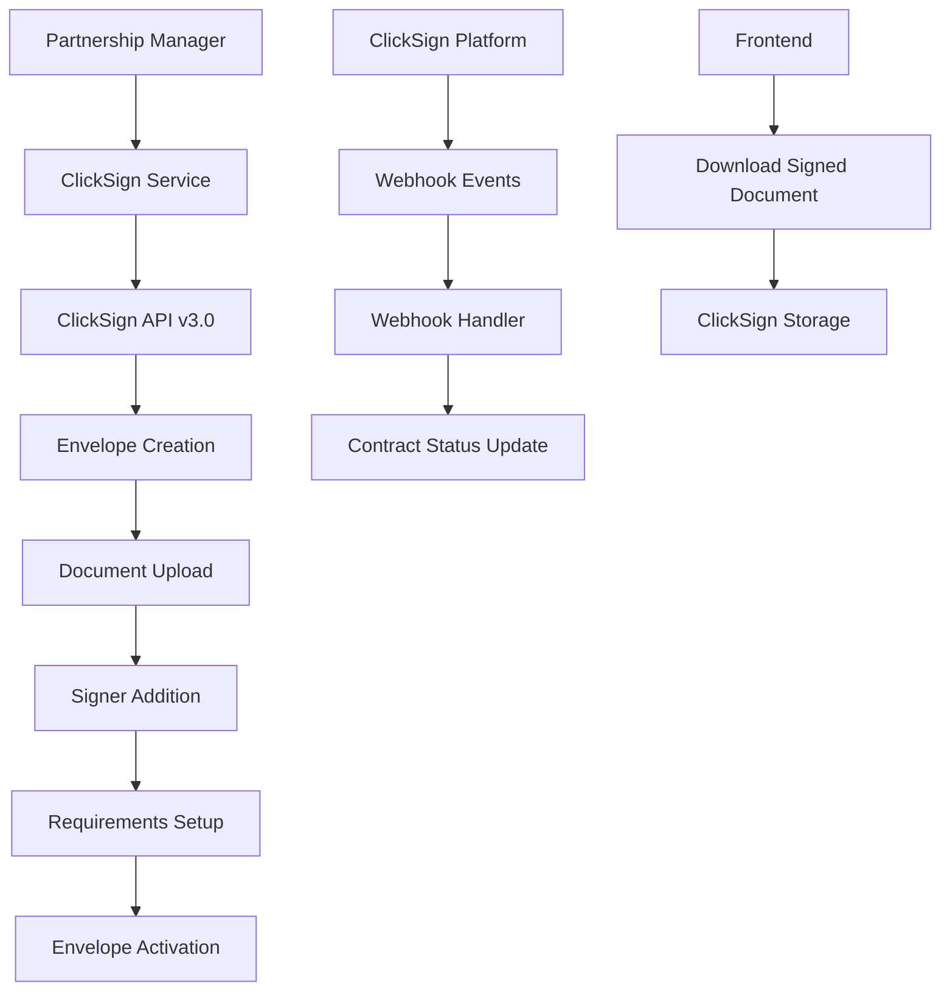

# Partnership Manager
## Fase 3 - Contratos: Plano de Execução

**Versão:** 1.0  
**Data:** 12 de Fevereiro de 2026  
**Duração Estimada:** 5 semanas (200 horas)  
**Regime:** 40 horas/semana (8h/dia × 5 dias)  
**Ambiente:** GitHub Agent (Claude/Cursor AI)  
**Baseado em:** DATABASE_DOCUMENTATION.md v2.0.0 e PREMISSAS_DESENVOLVIMENTO.md v1.0

---

## 📋 Sumário

1. [Análise do Estado Atual](#1-análise-do-estado-atual)
2. [Escopo da Fase 3](#2-escopo-da-fase-3)
3. [Pré-Requisitos e Dependências](#3-pré-requisitos-e-dependências)
4. [Estrutura de Tarefas Atômicas](#4-estrutura-de-tarefas-atômicas)
5. [Cronograma Detalhado](#5-cronograma-detalhado)
6. [Critérios de Aceite](#6-critérios-de-aceite)
7. [Templates para GitHub Agent](#7-templates-para-github-agent)
8. [Comandos e Verificações](#8-comandos-e-verificações)

---

## 1. Análise do Estado Atual

### 1.1 Infraestrutura Existente (Base Sólida)

| Componente | Status | Observação |
|------------|---------|------------|
| **Database Schema** | ✅ Definido | Tabelas de contratos especificadas no MER |
| **Backend Base** | ✅ Pronto | .NET 9, Dapper, padrões estabelecidos |
| **Frontend Base** | ✅ Pronto | React 18, TypeScript, Design System |
| **Autenticação** | ✅ Implementado | Firebase Auth + JWT |
| **Multi-tenancy** | ✅ Implementado | Client → Companies → Users |
| **Audit Trail** | ✅ Implementado | Logs de auditoria |

### 1.2 Entidades do Módulo Contratos (Conforme MER)

```
📦 Módulo Contratos
├── 📄 contract_templates     ← Templates reutilizáveis
├── 📝 clauses               ← Biblioteca de cláusulas
├── 📋 contracts             ← Contratos gerados
├── 👥 contract_parties      ← Partes envolvidas
└── 🔗 contract_clauses      ← Cláusulas por contrato
```

### 1.3 Funcionalidades Principais

| Funcionalidade | Descrição | Complexidade |
|---------------|-----------|--------------|
| **Templates de Contratos** | Modelos reutilizáveis com campos dinâmicos | Média |
| **Biblioteca de Cláusulas** | Cláusulas padronizadas e customizáveis | Média |
| **Contract Builder** | Interface para criação guiada de contratos | Alta |
| **Gestão de Contratos** | CRUD completo + status tracking | Média |
| **Assinatura Digital** | Integração com provedor externo | Alta |

---

## 2. Escopo da Fase 3

### 2.1 Objetivos Principais

1. **Módulo Completo de Contratos** - Templates, cláusulas, builder e gestão
2. **Contract Builder Interativo** - Wizard de 5 etapas para criação
3. **Integração com Assinatura Digital** - Fluxo de assinatura eletrônica
4. **Portal de Contratos** - Interface completa para gestão
5. **Motor de Geração** - Engine para merge de templates + dados

### 2.2 Entregáveis

```
📦 ENTREGÁVEIS FASE 3
├── 🗄️ Backend APIs
│   ├── ContractTemplateController (CRUD + clonagem)
│   ├── ClauseController (CRUD + categorização)
│   ├── ContractController (CRUD + builder + geração)
│   ├── ContractPartyController (gestão de partes)
│   └── SignatureController (integração externa)
├── 🎨 Frontend Pages
│   ├── /contracts (listagem + filtros)
│   ├── /contracts/templates (gestão de templates)
│   ├── /contracts/builder (wizard de criação)
│   └── /contracts/[id] (detalhes + assinatura)
├── 🔧 Features Especiais
│   ├── Contract Builder (5-step wizard)
│   ├── Template Engine (merge dados)
│   ├── Signature Integration (webhook)
│   └── Status Tracking (timeline visual)
└── 🧪 Testes
    ├── Unit Tests (Backend)
    ├── Integration Tests (APIs)
    └── E2E Tests (Fluxos críticos)
```

---

## 3. Pré-Requisitos e Dependências

### 3.1 Dependências Técnicas

| Dependência | Status | Ação Necessária |
|-------------|---------|-----------------|
| Database tables | ⚠️ Pendente | Criar migrations das tabelas |
| Shareholder entities | ✅ Pronto | Reutilizar from CapTable module |
| Document storage | ⚠️ Pendente | Configurar provider (S3/Local) |
| Email service | ⚠️ Pendente | Configurar Resend/SendGrid |
| **ClickSign Integration** | ⚠️ Pendente | **Provedor oficial escolhido** |

### 3.2 Dependências de Produto

| Item | Responsável | Prazo |
|------|------------|-------|
| **Conta ClickSign API ativa** | **DevOps/Product** | **Semana 1** |
| **Webhook URL configurada** | **DevOps** | **Semana 1** |
| Definir templates padrão | Legal Team | Semana 2 |
| Definir cláusulas obrigatórias | Legal Team | Semana 2 |
| Revisar fluxo de aprovação | Business | Semana 3 |

---

## 4. Estrutura de Tarefas Atômicas

### 4.1 Convenção de Nomenclatura

```
[F3]-[MÓDULO]-[TIPO]-[NÚMERO]: Descrição

Módulos:
- TPL: Templates
- CLS: Clauses  
- CTR: Contracts
- BLD: Builder
- SGN: Signature

Tipos:
- DB: Database/Migration
- BE: Backend
- FE: Frontend
- INT: Integração
- TST: Teste
- DOC: Documentação
```

### 4.2 Matriz de Dependências

```
┌─────────────────────────────────────────────────────────────────────────┐
│                       MAPA DE DEPENDÊNCIAS - FASE 3                     │
├─────────────────────────────────────────────────────────────────────────┤
│                                                                         │
│  ┌──────────────────────────────────────────────────────────────────┐   │
│  │                    SEMANA 1: DATABASE                            │   │
│  │  F3-DB-001 (contracts tables) ──► F3-DB-002 (stored procs)      │   │
│  └──────────────────┬───────────────────────────────────────────────┘   │
│                     │                                                   │
│                     ▼                                                   │
│  ┌──────────────────────────────────────────────────────────────────┐   │
│  │                    SEMANA 2: BACKEND CORE                       │   │
│  │  F3-TPL-BE-* ──► F3-CLS-BE-* ──► F3-CTR-BE-*                    │   │
│  └──────────────────┬───────────────────────────────────────────────┘   │
│                     │                                                   │
│                     ▼                                                   │
│  ┌──────────────────────────────────────────────────────────────────┐   │
│  │                    SEMANA 3: CONTRACT BUILDER                   │   │
│  │  F3-BLD-BE-001 (Engine) ──► F3-BLD-FE-* (Wizard)                │   │
│  └──────────────────┬───────────────────────────────────────────────┘   │
│                     │                                                   │
│                     ▼                                                   │
│  ┌──────────────────────────────────────────────────────────────────┐   │
│  │                    SEMANA 4: FRONTEND PAGES                     │   │
│  │  F3-CTR-FE-* (Pages) ──► F3-TPL-FE-* (Templates)                │   │
│  └──────────────────┬───────────────────────────────────────────────┘   │
│                     │                                                   │
│                     ▼                                                   │
│  ┌──────────────────────────────────────────────────────────────────┐   │
│  │                    SEMANA 5: INTEGRAÇÃO + TESTES                │   │
│  │  F3-SGN-INT-* (Signature) ──► F3-TST-* (Tests)                  │   │
│  └──────────────────────────────────────────────────────────────────┘   │
│                                                                         │
└─────────────────────────────────────────────────────────────────────────┘
```

---

## 5. Cronograma Detalhado

### Semana 1: Database + Entities (40h)

| ID | Tarefa | Tipo | Horas | Responsável | Dependência |
|----|--------|------|-------|-------------|-------------|
| F3-DB-001 | Criar tabelas do módulo contratos | DB | 8h | BE1 | - |
| F3-DB-002 | Stored procedures para relatórios | DB | 4h | BE1 | F3-DB-001 |
| F3-TPL-BE-001 | Entity ContractTemplate + enums | BE | 4h | BE1 | F3-DB-001 |
| F3-CLS-BE-001 | Entity Clause + enums | BE | 4h | BE1 | F3-DB-001 |
| F3-CTR-BE-001 | Entity Contract + enums | BE | 6h | BE1 | F3-DB-001 |
| F3-CTR-BE-002 | Entities ContractParty + ContractClause | BE | 6h | BE2 | F3-CTR-BE-001 |
| F3-BE-001 | DTOs base para todos os módulos | BE | 8h | BE2 | F3-CTR-BE-002 |

**Entregável:** Estrutura de banco e entidades de domínio

### Semana 2: Backend APIs Core (40h)

| ID | Tarefa | Tipo | Horas | Responsável | Dependência |
|----|--------|------|-------|-------------|-------------|
| F3-TPL-BE-002 | Repository ContractTemplateRepository | BE | 6h | BE1 | F3-TPL-BE-001 |
| F3-TPL-BE-003 | Service + Validators para Templates | BE | 6h | BE1 | F3-TPL-BE-002 |
| F3-TPL-BE-004 | Controller ContractTemplateController | BE | 4h | BE1 | F3-TPL-BE-003 |
| F3-CLS-BE-002 | Repository + Service + Controller Clauses | BE | 8h | BE2 | F3-CLS-BE-001 |
| F3-CTR-BE-003 | Repository ContractRepository (base) | BE | 8h | BE1 | F3-BE-001 |
| F3-CTR-BE-004 | Service + Validators para Contracts | BE | 8h | BE2 | F3-CTR-BE-003 |

**Entregável:** APIs REST completas para Templates, Clauses e Contracts

### Semana 3: Contract Builder + Engine (40h)

| ID | Tarefa | Tipo | Horas | Responsável | Dependência |
|----|--------|------|-------|-------------|-------------|
| F3-BLD-BE-001 | Motor de geração de contratos (merge engine) | BE | 12h | BE1 | F3-CTR-BE-004 |
| F3-BLD-BE-002 | API ContractBuilder (workflow de 5 etapas) | BE | 8h | BE1 | F3-BLD-BE-001 |
| F3-CTR-BE-005 | API ContractParty (adicionar/remover partes) | BE | 6h | BE2 | F3-BLD-BE-002 |
| F3-CTR-BE-006 | API ContractClause (selecionar cláusulas) | BE | 6h | BE2 | F3-CTR-BE-005 |
| F3-CTR-BE-007 | Controller ContractController (CRUD completo) | BE | 8h | BE1 | F3-CTR-BE-006 |

**Entregável:** Contract Builder funcional + APIs de gestão

### Semana 4: Frontend Contratos (40h)

| ID | Tarefa | Tipo | Horas | Responsável | Dependência |
|----|--------|------|-------|-------------|-------------|
| F3-FE-001 | Página /contracts (listagem + filtros) | FE | 8h | FE1 | F3-CTR-BE-007 |
| F3-FE-002 | Página /contracts/templates (gestão) | FE | 6h | FE1 | F3-TPL-BE-004 |
| F3-FE-003 | Components base (ContractCard, StatusBadge) | FE | 4h | FE2 | F3-FE-001 |
| F3-BLD-FE-001 | Contract Builder - Step 1: Selecionar tipo | FE | 4h | FE1 | F3-BLD-BE-002 |
| F3-BLD-FE-002 | Contract Builder - Step 2: Adicionar partes | FE | 6h | FE1 | F3-BLD-FE-001 |
| F3-BLD-FE-003 | Contract Builder - Step 3: Selecionar cláusulas | FE | 6h | FE2 | F3-BLD-FE-002 |
| F3-BLD-FE-004 | Contract Builder - Step 4: Preencher dados | FE | 6h | FE2 | F3-BLD-FE-003 |

**Entregável:** Interface de contratos + Contract Builder (parcial)

### Semana 5: ClickSign Integration + Testes (40h)

| ID | Tarefa | Tipo | Horas | Responsável | Dependência |
|----|--------|------|-------|-------------|-------------|
| F3-BLD-FE-005 | Contract Builder - Step 5: Preview + Geração | FE | 8h | FE1 | F3-BLD-FE-004 |
| F3-FE-004 | Página /contracts/[id] (detalhes + timeline) | FE | 8h | FE2 | F3-BLD-FE-005 |
| **F3-SGN-INT-001** | **Integração ClickSign API (Envelope + Signers)** | **INT** | **8h** | **BE1** | **F3-FE-004** |
| **F3-SGN-INT-002** | **ClickSign Webhook Handler + Event Processing** | **INT** | **4h** | **BE1** | **F3-SGN-INT-001** |
| F3-TST-001 | Testes unitários + integração | TST | 8h | QA | F3-SGN-INT-002 |
| **F3-SGN-CFG-001** | **Configuração ClickSign (appsettings + DI)** | **CFG** | **4h** | **BE2** | **F3-SGN-INT-002** |

**Entregável:** Sistema completo de contratos com **ClickSign** integrado

---

## 6. Critérios de Aceite

### 6.1 Funcional

```
✅ Templates de Contratos
├── ✓ CRUD completo de templates
├── ✓ Clonagem de templates existentes  
├── ✓ Categorização por tipo de contrato
├── ✓ Campos dinâmicos configuráveis
└── ✓ Preview de template com dados mock

✅ Biblioteca de Cláusulas  
├── ✓ CRUD completo de cláusulas
├── ✓ Categorização por tipo (compliance, governance, etc)
├── ✓ Variáveis dinâmicas em cláusulas
├── ✓ Ordenação e agrupamento
└── ✓ Marcação de cláusulas obrigatórias

✅ Contract Builder
├── ✓ Wizard de 5 etapas funcionando
├── ✓ Validação em cada etapa
├── ✓ Navegação livre entre etapas
├── ✓ Salvamento de progresso
└── ✓ Preview final antes de gerar

✅ Gestão de Contratos
├── ✓ Listagem com filtros avançados
├── ✓ Busca textual em conteúdo
├── ✓ Status tracking com timeline
├── ✓ Gestão de partes envolvidas
└── ✓ Download de documentos

✅ Assinatura Digital
├── ✓ Envio para assinatura externa
├── ✓ Tracking de status em tempo real
├── ✓ Notificações automáticas
├── ✓ Webhook de atualização
└── ✓ Download de documento assinado

✅ **Integração ClickSign Específica**
├── ✓ **Criação de Envelope via API v3.0**
├── ✓ **Upload de documentos PDF (base64)**
├── ✓ **Adição de signatários com dados completos**  
├── ✓ **Requisitos de qualificação e autenticação**
├── ✓ **Ativação do envelope (status: running)**
├── ✓ **Webhook handler para todos os eventos**
├── ✓ **Download automático de documentos finalizados**
├── ✓ **Widget Embedded para assinatura in-app**
├── ✓ **Suporte aos métodos de autenticação: email, SMS, biometria**
└── ✓ **Ambiente Sandbox configurado para testes**
```

### 6.2 Técnico

```
✅ Backend
├── ✓ Todas as APIs retornam status HTTP corretos
├── ✓ Validação completa com FluentValidation
├── ✓ Queries otimizadas (< 100ms para listas)
├── ✓ Soft delete implementado
├── ✓ Audit trail em todas as operações
├── ✓ Rate limiting configurado
├── ✓ Swagger documentation atualizada
└── ✓ Cobertura de testes > 80%

✅ Frontend  
├── ✓ Componentes responsivos (mobile-first)
├── ✓ Loading states em todas as operações
├── ✓ Error handling com mensagens claras
├── ✓ Validação client-side com React Hook Form
├── ✓ Cache otimizado com React Query
├── ✓ Navegação com router guard
├── ✓ Accessibility (WCAG 2.1 AA)
└── ✓ Performance (LCP < 2.5s, FID < 100ms)

✅ Integração
├── ✓ Webhook handler resiliente (retry logic)
├── ✓ Timeout configurations adequadas  
├── ✓ Error handling para falhas da API externa
├── ✓ Logs estruturados para debugging
└── ✓ Fallback para operação manual
```

### 6.3 Segurança

```
✅ Autenticação & Autorização
├── ✓ Todos os endpoints protegidos por JWT
├── ✓ Validação de company_id em queries
├── ✓ Rate limiting por usuário/IP
└── ✓ Logs de acesso sensível

✅ Dados Sensíveis
├── ✓ Documentos armazenados com criptografia
├── ✓ URLs de assinatura com expiração
├── ✓ PII mascarado em logs
└── ✓ GDPR compliance (right to be forgotten)

✅ Integrações Externas
├── ✓ API keys armazenadas em secrets
├── ✓ Validation de webhooks (HMAC)
├── ✓ Timeout e circuit breaker
└── ✓ Audit de chamadas externas
```

---

## 7. Templates para GitHub Agent

### 7.1 Controle de Progresso (OBRIGATÓRIO)

```markdown
## SISTEMA DE PROGRESSO - FASE 3

### Arquivo: FASE3_PROGRESSO.md

**Objetivo:** Eliminar tempo de re-análise quando retomar trabalho.

**Regras:**
1. SEMPRE atualizar este arquivo ao iniciar/pausar/concluir tarefas
2. NUNCA reanalisar tarefas marcadas como [x]
3. SEMPRE verificar última sessão antes de continuar
4. MARCAR claramente próxima tarefa pendente

**Estados de Tarefa:**
- [ ] Pendente
- [🔄] Em andamento  
- [⏸️] Pausado
- [x] Concluído
- [❌] Bloqueado
```

### 7.2 Template: Iniciar Tarefa

```markdown
Implementar tarefa F3-{MÓDULO}-{TIPO}-{NÚMERO}: {DESCRIÇÃO}

## VERIFICAÇÃO OBRIGATÓRIA
1. ✅ Li PREMISSAS_DESENVOLVIMENTO.md
2. ✅ Verifiquei se entidade/componente já existe
3. ✅ Identifiquei arquivos de referência similares
4. ✅ Confirmei estrutura de pastas correta

## CONTEXTO  
- Módulo: Contratos
- Fase: 3
- Baseado em: [arquivo de referência similar]
- Dependencies: [tarefas dependentes]

## CRITÉRIOS DE ACEITE
- [ ] Código segue padrões de PREMISSAS_DESENVOLVIMENTO.md
- [ ] Não há duplicação de código existente
- [ ] Testes implementados (se aplicável)
- [ ] Build sem erros (dotnet build / npm run build)
- [ ] Documentação atualizada

## VERIFICAÇÃO FINAL
```bash
# Backend
cd src/backend && dotnet build --no-restore

# Frontend  
cd src/frontend && npm run lint && npm run build

# Validar em browser/Swagger
```
```

### 7.3 Template: Database Migration

```sql
-- Migration: F3-DB-001 - Criar tabelas do módulo contratos
-- Autor: [NOME]
-- Data: [DATA]
-- Descrição: Implementar schema completo para contratos

USE partnership_manager;

-- ============================================
-- TIPOS ENUM (se não existirem)
-- ============================================

-- Tipos de template de contrato
CREATE TYPE contract_template_type AS ENUM (
  'stock_option',
  'shareholders_agreement', 
  'investment_agreement',
  'nda',
  'advisor_agreement',
  'vesting_agreement',
  'other'
);

-- ============================================
-- TABELAS PRINCIPAIS  
-- ============================================

-- 1. Templates de Contratos
CREATE TABLE contract_templates (
    id CHAR(36) NOT NULL PRIMARY KEY,
    client_id CHAR(36) NOT NULL,
    company_id CHAR(36) NOT NULL,
    name VARCHAR(200) NOT NULL,
    code VARCHAR(50) NOT NULL,
    template_type contract_template_type NOT NULL,
    description TEXT,
    icon VARCHAR(10),
    default_data JSON,
    required_fields JSON,
    workflow_type VARCHAR(50),
    is_active TINYINT(1) NOT NULL DEFAULT 1,
    version INTEGER NOT NULL DEFAULT 1,
    created_by CHAR(36) NOT NULL,
    created_at DATETIME(6) NOT NULL DEFAULT CURRENT_TIMESTAMP(6),
    updated_at DATETIME(6) NOT NULL DEFAULT CURRENT_TIMESTAMP(6) ON UPDATE CURRENT_TIMESTAMP(6),
    is_deleted TINYINT(1) NOT NULL DEFAULT 0,
    deleted_at DATETIME(6) NULL,
    
    -- Constraints
    CONSTRAINT fk_contract_template_client FOREIGN KEY (client_id) REFERENCES clients(id) ON DELETE RESTRICT,
    CONSTRAINT fk_contract_template_company FOREIGN KEY (company_id) REFERENCES companies(id) ON DELETE RESTRICT,
    CONSTRAINT fk_contract_template_creator FOREIGN KEY (created_by) REFERENCES users(id) ON DELETE RESTRICT,
    
    -- Indexes
    INDEX idx_contract_template_client (client_id),
    INDEX idx_contract_template_company (company_id), 
    INDEX idx_contract_template_type (template_type),
    INDEX idx_contract_template_active (is_active),
    INDEX idx_contract_template_deleted (is_deleted),
    UNIQUE INDEX idx_contract_template_company_code (company_id, code, is_deleted)
);

-- [Continuar com outras tabelas...]

-- ============================================
-- STORED PROCEDURES
-- ============================================

-- Relatório de contratos por status
DELIMITER $$
CREATE PROCEDURE GetContractsByStatus(
    IN p_company_id CHAR(36),
    IN p_start_date DATE,
    IN p_end_date DATE
)
BEGIN
    -- Implementação
END$$
DELIMITER ;

-- ============================================
-- DADOS INICIAIS (SEEDS)
-- ============================================

-- Templates padrão por empresa
-- [Inserir dados de exemplo]

-- ============================================
-- VERIFICAÇÕES PÓS-MIGRATION
-- ============================================

-- Verificar foreign keys
SELECT 
    TABLE_NAME,
    CONSTRAINT_NAME, 
    REFERENCED_TABLE_NAME
FROM information_schema.REFERENTIAL_CONSTRAINTS 
WHERE CONSTRAINT_SCHEMA = 'partnership_manager'
AND TABLE_NAME LIKE 'contract%';
```

### 7.4 Template: Backend Entity

```csharp
// F3-TPL-BE-001: Entity ContractTemplate
// Arquivo: src/backend/PartnershipManager.Domain/Entities/ContractTemplate.cs
// Baseado em: Shareholder.cs (para padrões)

using PartnershipManager.Domain.Entities.Base;
using PartnershipManager.Domain.Enums;

namespace PartnershipManager.Domain.Entities;

/// <summary>
/// Template reutilizável para geração de contratos
/// </summary>
public class ContractTemplate : BaseEntity
{
    #region Properties
    
    /// <summary>
    /// Cliente proprietário (multi-tenancy)
    /// </summary>
    public Guid ClientId { get; set; }
    
    /// <summary>
    /// Empresa associada ao template
    /// </summary>
    public Guid CompanyId { get; set; }
    
    /// <summary>
    /// Nome do template
    /// </summary>
    public string Name { get; set; } = string.Empty;
    
    /// <summary>
    /// Código único do template (para referência)
    /// </summary>
    public string Code { get; set; } = string.Empty;
    
    /// <summary>
    /// Tipo de contrato que este template gera
    /// </summary>
    public ContractTemplateType TemplateType { get; set; }
    
    /// <summary>
    /// Descrição do template e seu uso
    /// </summary>
    public string? Description { get; set; }
    
    /// <summary>
    /// Ícone/emoji para identificação visual
    /// </summary>
    public string? Icon { get; set; }
    
    /// <summary>
    /// Dados padrão em formato JSON
    /// </summary>
    public string? DefaultData { get; set; }
    
    /// <summary>
    /// Campos obrigatórios para este template
    /// </summary>
    public string? RequiredFields { get; set; }
    
    /// <summary>
    /// Tipo de workflow a ser disparado após criação
    /// </summary>
    public string? WorkflowType { get; set; }
    
    /// <summary>
    /// Template ativo para uso
    /// </summary>
    public bool IsActive { get; set; } = true;
    
    /// <summary>
    /// Versão do template (para versionamento)
    /// </summary>
    public int Version { get; set; } = 1;

    #endregion

    #region Navigation Properties
    
    /// <summary>
    /// Cliente proprietário
    /// </summary>
    public Client? Client { get; set; }
    
    /// <summary>
    /// Empresa associada
    /// </summary>
    public Company? Company { get; set; }
    
    /// <summary>
    /// Contratos criados a partir deste template
    /// </summary>
    public ICollection<Contract> Contracts { get; set; } = new List<Contract>();

    #endregion

    #region Business Methods
    
    /// <summary>
    /// Clona este template com novo nome
    /// </summary>
    public ContractTemplate Clone(string newName, string newCode)
    {
        return new ContractTemplate
        {
            Id = Guid.NewGuid(),
            ClientId = this.ClientId,
            CompanyId = this.CompanyId,
            Name = newName,
            Code = newCode,
            TemplateType = this.TemplateType,
            Description = this.Description,
            Icon = this.Icon,
            DefaultData = this.DefaultData,
            RequiredFields = this.RequiredFields,
            WorkflowType = this.WorkflowType,
            IsActive = true,
            Version = 1,
            CreatedBy = this.CreatedBy,
            CreatedAt = DateTime.UtcNow,
            UpdatedAt = DateTime.UtcNow
        };
    }
    
    /// <summary>
    /// Verifica se template está pronto para uso
    /// </summary>
    public bool IsReadyForUse => IsActive && !IsDeleted;

    #endregion
}
```

### 7.5 Template: Frontend Component

```typescript
// F3-FE-003: Component ContractCard
// Arquivo: src/frontend/src/components/contracts/ContractCard.tsx
// Baseado em: ShareholderCard.tsx (para padrões)

import React from 'react';
import { Card, CardContent, CardHeader } from '@/components/ui/card';
import { Badge } from '@/components/ui/badge';
import { Button } from '@/components/ui/button';
import { Eye, Edit, Trash2, Users, Calendar, FileText } from 'lucide-react';
import { Contract, ContractStatus } from '@/types/contracts';
import { formatDate } from '@/utils/dateUtils';
import { cn } from '@/lib/utils';

interface ContractCardProps {
  contract: Contract;
  onView?: (contract: Contract) => void;
  onEdit?: (contract: Contract) => void;
  onDelete?: (contract: Contract) => void;
  className?: string;
}

const statusConfig = {
  [ContractStatus.Draft]: {
    label: 'Rascunho',
    className: 'bg-gray-100 text-gray-700',
    icon: FileText
  },
  [ContractStatus.PendingSignature]: {
    label: 'Pendente Assinatura',
    className: 'bg-yellow-100 text-yellow-700',
    icon: Users
  },
  [ContractStatus.Signed]: {
    label: 'Assinado',
    className: 'bg-green-100 text-green-700',
    icon: Calendar
  },
  [ContractStatus.Cancelled]: {
    label: 'Cancelado',
    className: 'bg-red-100 text-red-700',
    icon: Trash2
  }
} as const;

export const ContractCard: React.FC<ContractCardProps> = ({
  contract,
  onView,
  onEdit,
  onDelete,
  className
}) => {
  const statusInfo = statusConfig[contract.status];
  const StatusIcon = statusInfo.icon;

  return (
    <Card className={cn('hover:shadow-md transition-shadow duration-200', className)}>
      <CardHeader className="pb-3">
        <div className="flex items-start justify-between">
          <div className="flex-1">
            <h3 className="font-semibold text-lg text-gray-900 mb-1">
              {contract.name}
            </h3>
            <p className="text-sm text-gray-600">
              {contract.contractNumber} • {contract.contractType}
            </p>
          </div>
          <Badge variant="secondary" className={statusInfo.className}>
            <StatusIcon className="w-3 h-3 mr-1" />
            {statusInfo.label}
          </Badge>
        </div>
      </CardHeader>
      
      <CardContent className="pt-0">
        <div className="space-y-3">
          {/* Informações principais */}
          <div className="grid grid-cols-2 gap-4 text-sm">
            <div>
              <span className="text-gray-500">Partes:</span>
              <p className="font-medium">{contract.partiesCount} partes</p>
            </div>
            <div>
              <span className="text-gray-500">Criado em:</span>
              <p className="font-medium">{formatDate(contract.createdAt)}</p>
            </div>
          </div>

          {/* Data de vigência */}
          {contract.effectiveDate && (
            <div className="text-sm">
              <span className="text-gray-500">Vigência:</span>
              <p className="font-medium">{formatDate(contract.effectiveDate)}</p>
            </div>
          )}

          {/* Ações */}
          <div className="flex justify-end space-x-2 pt-2 border-t">
            {onView && (
              <Button
                variant="outline"
                size="sm"
                onClick={() => onView(contract)}
                className="text-gray-600 hover:text-gray-900"
              >
                <Eye className="w-4 h-4 mr-1" />
                Ver
              </Button>
            )}
            
            {onEdit && contract.status === ContractStatus.Draft && (
              <Button
                variant="outline"
                size="sm"
                onClick={() => onEdit(contract)}
                className="text-blue-600 hover:text-blue-900"
              >
                <Edit className="w-4 h-4 mr-1" />
                Editar
              </Button>
            )}
            
            {onDelete && contract.status === ContractStatus.Draft && (
              <Button
                variant="destructive"
                size="sm"
                onClick={() => onDelete(contract)}
              >
                <Trash2 className="w-4 h-4 mr-1" />
                Excluir
              </Button>
            )}
          </div>
        </div>
      </CardContent>
    </Card>
  );
};

export default ContractCard;
```

### 7.6 Template: Integração com ClickSign

#### 7.6.1 Configuração Backend (.NET)

```csharp
// F3-SGN-INT-001: Configuração ClickSign
// Arquivo: src/backend/PartnershipManager.Infrastructure/Services/ClickSignService.cs
// Baseado em: EmailService.cs (para padrões de integração)

using System.Text;
using System.Text.Json;
using PartnershipManager.Domain.Constants;
using PartnershipManager.Application.DTOs.Signature;
using Microsoft.Extensions.Configuration;
using Microsoft.Extensions.Logging;

namespace PartnershipManager.Infrastructure.Services;

public class ClickSignService : ISignatureService
{
    private readonly HttpClient _httpClient;
    private readonly IConfiguration _configuration;
    private readonly ILogger<ClickSignService> _logger;
    
    private readonly string _baseUrl;
    private readonly string _accessToken;
    private readonly bool _isSandbox;

    public ClickSignService(
        HttpClient httpClient,
        IConfiguration configuration,
        ILogger<ClickSignService> logger)
    {
        _httpClient = httpClient;
        _configuration = configuration;
        _logger = logger;
        
        _isSandbox = _configuration.GetValue<bool>("ClickSign:UseSandbox");
        _baseUrl = _isSandbox 
            ? "https://sandbox.clicksign.com/api/v3" 
            : "https://app.clicksign.com/api/v3";
        _accessToken = _configuration["ClickSign:AccessToken"] 
            ?? throw new InvalidOperationException("ClickSign AccessToken não configurado");
            
        ConfigureHttpClient();
    }

    private void ConfigureHttpClient()
    {
        _httpClient.BaseAddress = new Uri(_baseUrl);
        _httpClient.DefaultRequestHeaders.Add("Authorization", $"Bearer {_accessToken}");
        _httpClient.DefaultRequestHeaders.Add("Content-Type", "application/vnd.api+json");
        _httpClient.DefaultRequestHeaders.Add("Accept", "application/vnd.api+json");
    }

    /// <summary>
    /// Cria um envelope (container para documentos e signatários)
    /// </summary>
    public async Task<ClickSignEnvelopeResponse> CreateEnvelopeAsync(CreateEnvelopeRequest request)
    {
        try
        {
            var payload = new
            {
                data = new
                {
                    type = "envelopes",
                    attributes = new
                    {
                        name = request.Name,
                        locale = "pt-BR",
                        sequence_enabled = request.SequenceEnabled,
                        auto_close = request.AutoClose,
                        remind_interval = request.RemindInterval ?? 3
                    }
                }
            };

            var json = JsonSerializer.Serialize(payload, new JsonSerializerOptions
            {
                PropertyNamingPolicy = JsonNamingPolicy.SnakeCaseLower
            });

            var response = await _httpClient.PostAsync("/envelopes", 
                new StringContent(json, Encoding.UTF8, "application/vnd.api+json"));

            if (!response.IsSuccessStatusCode)
            {
                var error = await response.Content.ReadAsStringAsync();
                _logger.LogError("Erro ao criar envelope ClickSign: {Error}", error);
                throw new Exception($"Erro ClickSign: {response.StatusCode}");
            }

            var result = await response.Content.ReadAsStringAsync();
            var envelope = JsonSerializer.Deserialize<ClickSignEnvelopeResponse>(result);
            
            _logger.LogInformation("Envelope criado com sucesso: {EnvelopeId}", envelope?.Data?.Id);
            return envelope ?? throw new Exception("Resposta inválida do ClickSign");
        }
        catch (Exception ex)
        {
            _logger.LogError(ex, "Erro ao criar envelope ClickSign");
            throw;
        }
    }

    /// <summary>
    /// Adiciona documento PDF ao envelope
    /// </summary>
    public async Task<ClickSignDocumentResponse> AddDocumentAsync(string envelopeId, AddDocumentRequest request)
    {
        try
        {
            using var form = new MultipartFormDataContent();
            
            // Metadata do documento
            var documentData = new
            {
                data = new
                {
                    type = "documents",
                    attributes = new
                    {
                        filename = request.FileName,
                        content_base64 = Convert.ToBase64String(request.FileContent)
                    }
                }
            };

            var json = JsonSerializer.Serialize(documentData, new JsonSerializerOptions
            {
                PropertyNamingPolicy = JsonNamingPolicy.SnakeCaseLower
            });

            var response = await _httpClient.PostAsync($"/envelopes/{envelopeId}/documents",
                new StringContent(json, Encoding.UTF8, "application/vnd.api+json"));

            if (!response.IsSuccessStatusCode)
            {
                var error = await response.Content.ReadAsStringAsync();
                _logger.LogError("Erro ao adicionar documento: {Error}", error);
                throw new Exception($"Erro ClickSign: {response.StatusCode}");
            }

            var result = await response.Content.ReadAsStringAsync();
            return JsonSerializer.Deserialize<ClickSignDocumentResponse>(result) 
                ?? throw new Exception("Resposta inválida do ClickSign");
        }
        catch (Exception ex)
        {
            _logger.LogError(ex, "Erro ao adicionar documento ao envelope {EnvelopeId}", envelopeId);
            throw;
        }
    }

    /// <summary>
    /// Adiciona signatário ao envelope
    /// </summary>
    public async Task<ClickSignSignerResponse> AddSignerAsync(string envelopeId, AddSignerRequest request)
    {
        try
        {
            var payload = new
            {
                data = new
                {
                    type = "signers",
                    attributes = new
                    {
                        name = request.Name,
                        email = request.Email,
                        phone_number = request.PhoneNumber,
                        documentation = request.DocumentNumber
                    }
                }
            };

            var json = JsonSerializer.Serialize(payload, new JsonSerializerOptions
            {
                PropertyNamingPolicy = JsonNamingPolicy.SnakeCaseLower
            });

            var response = await _httpClient.PostAsync($"/envelopes/{envelopeId}/signers",
                new StringContent(json, Encoding.UTF8, "application/vnd.api+json"));

            if (!response.IsSuccessStatusCode)
            {
                var error = await response.Content.ReadAsStringAsync();
                _logger.LogError("Erro ao adicionar signatário: {Error}", error);
                throw new Exception($"Erro ClickSign: {response.StatusCode}");
            }

            var result = await response.Content.ReadAsStringAsync();
            return JsonSerializer.Deserialize<ClickSignSignerResponse>(result)
                ?? throw new Exception("Resposta inválida do ClickSign");
        }
        catch (Exception ex)
        {
            _logger.LogError(ex, "Erro ao adicionar signatário ao envelope {EnvelopeId}", envelopeId);
            throw;
        }
    }

    /// <summary>
    /// Cria requisitos (conecta signatário ao documento)
    /// </summary>
    public async Task CreateRequirementsAsync(string envelopeId, CreateRequirementsRequest request)
    {
        try
        {
            // 1. Requisito de Qualificação (papel do signatário)
            var qualificationPayload = new
            {
                data = new
                {
                    type = "requirements",
                    attributes = new
                    {
                        action = "agree",
                        role = request.Role // "sign", "witness", "intervening"
                    },
                    relationships = new
                    {
                        document = new
                        {
                            data = new { type = "documents", id = request.DocumentId }
                        },
                        signer = new
                        {
                            data = new { type = "signers", id = request.SignerId }
                        }
                    }
                }
            };

            // 2. Requisito de Autenticação 
            var authPayload = new
            {
                data = new
                {
                    type = "requirements",
                    attributes = new
                    {
                        action = "provide_evidence",
                        auth = request.AuthMethod // "email", "sms", "biometric_facial"
                    },
                    relationships = new
                    {
                        document = new
                        {
                            data = new { type = "documents", id = request.DocumentId }
                        },
                        signer = new
                        {
                            data = new { type = "signers", id = request.SignerId }
                        }
                    }
                }
            };

            // Enviar requisitos
            await SendRequirementAsync(envelopeId, qualificationPayload);
            await SendRequirementAsync(envelopeId, authPayload);
            
            _logger.LogInformation("Requisitos criados para signatário {SignerId}", request.SignerId);
        }
        catch (Exception ex)
        {
            _logger.LogError(ex, "Erro ao criar requisitos");
            throw;
        }
    }

    private async Task SendRequirementAsync(string envelopeId, object payload)
    {
        var json = JsonSerializer.Serialize(payload, new JsonSerializerOptions
        {
            PropertyNamingPolicy = JsonNamingPolicy.SnakeCaseLower
        });

        var response = await _httpClient.PostAsync($"/envelopes/{envelopeId}/requirements",
            new StringContent(json, Encoding.UTF8, "application/vnd.api+json"));

        if (!response.IsSuccessStatusCode)
        {
            var error = await response.Content.ReadAsStringAsync();
            throw new Exception($"Erro ao criar requisito: {error}");
        }
    }

    /// <summary>
    /// Envia envelope para assinatura (ativa o processo)
    /// </summary>
    public async Task StartEnvelopeAsync(string envelopeId)
    {
        try
        {
            // 1. Ativar envelope
            var statusPayload = new
            {
                data = new
                {
                    id = envelopeId,
                    type = "envelopes",
                    attributes = new
                    {
                        status = "running"
                    }
                }
            };

            var json = JsonSerializer.Serialize(statusPayload, new JsonSerializerOptions
            {
                PropertyNamingPolicy = JsonNamingPolicy.SnakeCaseLower
            });

            var response = await _httpClient.PatchAsync($"/envelopes/{envelopeId}",
                new StringContent(json, Encoding.UTF8, "application/vnd.api+json"));

            if (!response.IsSuccessStatusCode)
            {
                var error = await response.Content.ReadAsStringAsync();
                throw new Exception($"Erro ao ativar envelope: {error}");
            }

            // 2. Enviar notificações
            var notificationPayload = new
            {
                data = new
                {
                    type = "notifications",
                    attributes = new { }
                }
            };

            var notificationJson = JsonSerializer.Serialize(notificationPayload, new JsonSerializerOptions
            {
                PropertyNamingPolicy = JsonNamingPolicy.SnakeCaseLower
            });

            var notificationResponse = await _httpClient.PostAsync($"/envelopes/{envelopeId}/notifications",
                new StringContent(notificationJson, Encoding.UTF8, "application/vnd.api+json"));

            if (!notificationResponse.IsSuccessStatusCode)
            {
                var error = await notificationResponse.Content.ReadAsStringAsync();
                _logger.LogWarning("Erro ao enviar notificações: {Error}", error);
            }

            _logger.LogInformation("Envelope {EnvelopeId} ativado e notificações enviadas", envelopeId);
        }
        catch (Exception ex)
        {
            _logger.LogError(ex, "Erro ao iniciar envelope {EnvelopeId}", envelopeId);
            throw;
        }
    }

    /// <summary>
    /// Consulta status do envelope
    /// </summary>
    public async Task<ClickSignEnvelopeResponse> GetEnvelopeAsync(string envelopeId)
    {
        try
        {
            var response = await _httpClient.GetAsync($"/envelopes/{envelopeId}");
            
            if (!response.IsSuccessStatusCode)
            {
                throw new Exception($"Erro ao consultar envelope: {response.StatusCode}");
            }

            var result = await response.Content.ReadAsStringAsync();
            return JsonSerializer.Deserialize<ClickSignEnvelopeResponse>(result)
                ?? throw new Exception("Resposta inválida do ClickSign");
        }
        catch (Exception ex)
        {
            _logger.LogError(ex, "Erro ao consultar envelope {EnvelopeId}", envelopeId);
            throw;
        }
    }

    /// <summary>
    /// Download do documento finalizado
    /// </summary>
    public async Task<byte[]> DownloadDocumentAsync(string envelopeId, string documentId)
    {
        try
        {
            var response = await _httpClient.GetAsync($"/envelopes/{envelopeId}/documents/{documentId}/download");
            
            if (!response.IsSuccessStatusCode)
            {
                throw new Exception($"Erro ao baixar documento: {response.StatusCode}");
            }

            return await response.Content.ReadAsByteArrayAsync();
        }
        catch (Exception ex)
        {
            _logger.LogError(ex, "Erro ao baixar documento {DocumentId}", documentId);
            throw;
        }
    }
}
```

#### 7.6.2 Webhook Handler

```csharp
// F3-SGN-BE-001: Webhook handler para ClickSign
// Arquivo: src/backend/PartnershipManager.API/Controllers/ClickSignWebhookController.cs

using Microsoft.AspNetCore.Mvc;
using PartnershipManager.Application.Services;
using PartnershipManager.Application.DTOs.ClickSign;
using System.Text.Json;

namespace PartnershipManager.API.Controllers;

[ApiController]
[Route("api/clicksign/webhook")]
public class ClickSignWebhookController : ControllerBase
{
    private readonly IContractService _contractService;
    private readonly ILogger<ClickSignWebhookController> _logger;
    private readonly IConfiguration _configuration;

    public ClickSignWebhookController(
        IContractService contractService,
        ILogger<ClickSignWebhookController> logger,
        IConfiguration configuration)
    {
        _contractService = contractService;
        _logger = logger;
        _configuration = configuration;
    }

    [HttpPost]
    public async Task<IActionResult> HandleWebhook([FromBody] ClickSignWebhookPayload payload)
    {
        try
        {
            _logger.LogInformation("Webhook recebido - Evento: {Event}, Envelope: {EnvelopeId}", 
                payload.Event, payload.Data?.Id);

            // Validar signature se configurado
            if (!ValidateWebhookSignature(payload))
            {
                _logger.LogWarning("Webhook com signature inválida");
                return Unauthorized();
            }

            // Processar evento
            await ProcessWebhookEvent(payload);

            return Ok(new { status = "success", message = "Webhook processado" });
        }
        catch (Exception ex)
        {
            _logger.LogError(ex, "Erro ao processar webhook ClickSign");
            return StatusCode(500, new { error = "Erro interno do servidor" });
        }
    }

    private bool ValidateWebhookSignature(ClickSignWebhookPayload payload)
    {
        // Implementar validação HMAC se necessário
        var webhookSecret = _configuration["ClickSign:WebhookSecret"];
        
        if (string.IsNullOrEmpty(webhookSecret))
        {
            return true; // Skip validation if not configured
        }

        // TODO: Implementar validação HMAC SHA256
        return true;
    }

    private async Task ProcessWebhookEvent(ClickSignWebhookPayload payload)
    {
        switch (payload.Event?.ToLowerInvariant())
        {
            case "sign":
                await HandleSignEvent(payload);
                break;
                
            case "close":
            case "document_closed":
                await HandleDocumentClosedEvent(payload);
                break;
                
            case "cancel":
                await HandleCancelEvent(payload);
                break;
                
            case "deadline":
                await HandleDeadlineEvent(payload);
                break;
                
            case "refusal":
                await HandleRefusalEvent(payload);
                break;
                
            default:
                _logger.LogInformation("Evento não tratado: {Event}", payload.Event);
                break;
        }
    }

    private async Task HandleSignEvent(ClickSignWebhookPayload payload)
    {
        if (payload.Data?.Attributes?.ExternalId == null) return;

        var contractId = Guid.Parse(payload.Data.Attributes.ExternalId);
        var signerEmail = payload.Data.Attributes.SignerEmail;

        _logger.LogInformation("Assinatura realizada - Contrato: {ContractId}, Signatário: {Email}", 
            contractId, signerEmail);

        await _contractService.UpdateSignatureStatusAsync(contractId, "signed", signerEmail);
    }

    private async Task HandleDocumentClosedEvent(ClickSignWebhookPayload payload)
    {
        if (payload.Data?.Attributes?.ExternalId == null) return;

        var contractId = Guid.Parse(payload.Data.Attributes.ExternalId);

        _logger.LogInformation("Documento finalizado - Contrato: {ContractId}", contractId);

        await _contractService.FinalizeContractAsync(contractId, payload.Data.Id);
    }

    private async Task HandleCancelEvent(ClickSignWebhookPayload payload)
    {
        if (payload.Data?.Attributes?.ExternalId == null) return;

        var contractId = Guid.Parse(payload.Data.Attributes.ExternalId);

        _logger.LogInformation("Documento cancelado - Contrato: {ContractId}", contractId);

        await _contractService.CancelContractAsync(contractId);
    }

    private async Task HandleDeadlineEvent(ClickSignWebhookPayload payload)
    {
        if (payload.Data?.Attributes?.ExternalId == null) return;

        var contractId = Guid.Parse(payload.Data.Attributes.ExternalId);

        _logger.LogWarning("Prazo expirado - Contrato: {ContractId}", contractId);

        await _contractService.ExpireContractAsync(contractId);
    }

    private async Task HandleRefusalEvent(ClickSignWebhookPayload payload)
    {
        if (payload.Data?.Attributes?.ExternalId == null) return;

        var contractId = Guid.Parse(payload.Data.Attributes.ExternalId);
        var signerEmail = payload.Data.Attributes.SignerEmail;
        var refusalReason = payload.Data.Attributes.RefusalReason;

        _logger.LogWarning("Documento recusado - Contrato: {ContractId}, Signatário: {Email}, Motivo: {Reason}", 
            contractId, signerEmail, refusalReason);

        await _contractService.RefuseContractAsync(contractId, signerEmail, refusalReason);
    }
}
```

#### 7.6.3 DTOs ClickSign

```csharp
// Arquivo: src/backend/PartnershipManager.Application/DTOs/ClickSign/ClickSignDTOs.cs

namespace PartnershipManager.Application.DTOs.ClickSign;

public record CreateEnvelopeRequest(
    string Name,
    bool SequenceEnabled = false,
    bool AutoClose = true,
    int? RemindInterval = 3
);

public record AddDocumentRequest(
    string FileName,
    byte[] FileContent
);

public record AddSignerRequest(
    string Name,
    string Email,
    string? PhoneNumber = null,
    string? DocumentNumber = null
);

public record CreateRequirementsRequest(
    string DocumentId,
    string SignerId,
    string Role, // "sign", "witness", "intervening"
    string AuthMethod // "email", "sms", "biometric_facial"
);

public record ClickSignEnvelopeResponse(
    ClickSignData Data,
    ClickSignMeta? Meta = null
);

public record ClickSignDocumentResponse(
    ClickSignData Data,
    ClickSignMeta? Meta = null
);

public record ClickSignSignerResponse(
    ClickSignData Data,
    ClickSignMeta? Meta = null
);

public record ClickSignData(
    string Id,
    string Type,
    ClickSignAttributes Attributes,
    ClickSignLinks? Links = null
);

public record ClickSignAttributes(
    string? Name = null,
    string? Status = null,
    DateTime? Created = null,
    DateTime? Modified = null,
    string? Email = null,
    string? ExternalId = null,
    string? SignerEmail = null,
    string? RefusalReason = null
);

public record ClickSignLinks(
    string Self
);

public record ClickSignMeta(
    object? Pagination = null
);

public record ClickSignWebhookPayload(
    string Event,
    ClickSignData Data,
    DateTime Timestamp
);
```

#### 7.6.4 Frontend Service

```typescript
// F3-SGN-FE-001: Service Frontend para ClickSign
// Arquivo: src/frontend/src/services/clickSignService.ts

import { api } from './api';
import { 
  SignatureRequest, 
  SignatureResponse, 
  SignatureStatus,
  ContractSignatureData 
} from '@/types/signature';

export class ClickSignService {
  private readonly baseUrl = '/api/signature/clicksign';

  /**
   * Envia contrato para assinatura via ClickSign
   */
  async sendContractForSignature(request: SignatureRequest): Promise<SignatureResponse> {
    try {
      const response = await api.post<SignatureResponse>(
        `${this.baseUrl}/send`,
        {
          contractId: request.contractId,
          signers: request.signers.map(signer => ({
            name: signer.name,
            email: signer.email,
            phoneNumber: signer.phoneNumber,
            documentNumber: signer.documentNumber,
            role: signer.role || 'sign',
            authMethod: signer.authMethod || 'email'
          })),
          settings: {
            autoClose: request.settings?.autoClose ?? true,
            remindInterval: request.settings?.remindInterval ?? 3,
            sequenceEnabled: request.settings?.sequenceEnabled ?? false,
            deadline: request.settings?.deadline
          }
        }
      );
      
      return response.data;
    } catch (error) {
      console.error('Error sending contract to ClickSign:', error);
      throw new Error('Falha ao enviar contrato para assinatura digital');
    }
  }

  /**
   * Consulta status atual de um contrato no ClickSign
   */
  async getContractStatus(contractId: string): Promise<SignatureStatus> {
    try {
      const response = await api.get<SignatureStatus>(
        `${this.baseUrl}/status/${contractId}`
      );
      
      return response.data;
    } catch (error) {
      console.error('Error fetching contract status:', error);
      throw new Error('Falha ao consultar status de assinatura');
    }
  }

  /**
   * Cancela processo de assinatura
   */
  async cancelSignature(contractId: string, reason?: string): Promise<void> {
    try {
      await api.post(`${this.baseUrl}/cancel/${contractId}`, {
        reason: reason || 'Cancelado pelo usuário'
      });
    } catch (error) {
      console.error('Error canceling signature:', error);
      throw new Error('Falha ao cancelar assinatura');
    }
  }

  /**
   * Reenvia notificação de assinatura para signatários específicos
   */
  async resendNotification(contractId: string, signerEmails?: string[]): Promise<void> {
    try {
      await api.post(`${this.baseUrl}/resend/${contractId}`, {
        signerEmails
      });
    } catch (error) {
      console.error('Error resending notification:', error);
      throw new Error('Falha ao reenviar notificação');
    }
  }

  /**
   * Download do documento finalizado com todas as assinaturas
   */
  async downloadSignedDocument(contractId: string): Promise<Blob> {
    try {
      const response = await api.get(
        `${this.baseUrl}/download/${contractId}`,
        { 
          responseType: 'blob',
          timeout: 30000 // 30s timeout para download
        }
      );
      
      return response.data;
    } catch (error) {
      console.error('Error downloading signed document:', error);
      throw new Error('Falha ao baixar documento assinado');
    }
  }

  /**
   * Obtém URL do Widget Embedded para assinatura in-app
   */
  async getEmbeddedSigningUrl(
    contractId: string, 
    signerEmail: string
  ): Promise<{ url: string; token: string }> {
    try {
      const response = await api.post<{ url: string; token: string }>(
        `${this.baseUrl}/embedded-url`,
        { contractId, signerEmail }
      );
      
      return response.data;
    } catch (error) {
      console.error('Error getting embedded signing URL:', error);
      throw new Error('Falha ao obter URL de assinatura incorporada');
    }
  }

  /**
   * Obtém histórico completo de eventos do contrato
   */
  async getContractEvents(contractId: string): Promise<ContractSignatureData[]> {
    try {
      const response = await api.get<ContractSignatureData[]>(
        `${this.baseUrl}/events/${contractId}`
      );
      
      return response.data;
    } catch (error) {
      console.error('Error fetching contract events:', error);
      throw new Error('Falha ao obter histórico de eventos');
    }
  }
}

export const clickSignService = new ClickSignService();
```

#### 7.6.5 React Hook para ClickSign

```typescript
// Arquivo: src/frontend/src/hooks/useClickSign.ts

import { useMutation, useQuery, useQueryClient } from '@tanstack/react-query';
import { clickSignService } from '@/services/clickSignService';
import { SignatureRequest, SignatureStatus } from '@/types/signature';
import { toast } from '@/components/ui/use-toast';

export const useClickSign = () => {
  const queryClient = useQueryClient();

  // Enviar para assinatura
  const sendForSignature = useMutation({
    mutationFn: (request: SignatureRequest) =>
      clickSignService.sendContractForSignature(request),
    onSuccess: (data) => {
      toast({
        title: "Sucesso",
        description: "Contrato enviado para assinatura digital!",
      });
      queryClient.invalidateQueries({ queryKey: ['contracts'] });
    },
    onError: (error) => {
      console.error('Error sending contract:', error);
      toast({
        title: "Erro",
        description: error.message || "Falha ao enviar contrato",
        variant: "destructive",
      });
    },
  });

  // Cancelar assinatura
  const cancelSignature = useMutation({
    mutationFn: ({ contractId, reason }: { contractId: string; reason?: string }) =>
      clickSignService.cancelSignature(contractId, reason),
    onSuccess: () => {
      toast({
        title: "Sucesso",
        description: "Processo de assinatura cancelado!",
      });
      queryClient.invalidateQueries({ queryKey: ['contracts'] });
    },
    onError: (error) => {
      toast({
        title: "Erro",
        description: error.message || "Falha ao cancelar assinatura",
        variant: "destructive",
      });
    },
  });

  // Reenviar notificação
  const resendNotification = useMutation({
    mutationFn: ({ contractId, emails }: { contractId: string; emails?: string[] }) =>
      clickSignService.resendNotification(contractId, emails),
    onSuccess: () => {
      toast({
        title: "Sucesso", 
        description: "Lembretes enviados aos signatários!",
      });
    },
    onError: (error) => {
      toast({
        title: "Erro",
        description: error.message || "Falha ao enviar lembretes",
        variant: "destructive",
      });
    },
  });

  // Download documento assinado
  const downloadDocument = useMutation({
    mutationFn: (contractId: string) => 
      clickSignService.downloadSignedDocument(contractId),
    onSuccess: (blob, contractId) => {
      // Criar download automático
      const url = window.URL.createObjectURL(blob);
      const a = document.createElement('a');
      a.href = url;
      a.download = `contrato-${contractId}-assinado.pdf`;
      document.body.appendChild(a);
      a.click();
      window.URL.revokeObjectURL(url);
      document.body.removeChild(a);

      toast({
        title: "Sucesso",
        description: "Documento assinado baixado!",
      });
    },
    onError: (error) => {
      toast({
        title: "Erro",
        description: error.message || "Falha ao baixar documento",
        variant: "destructive",
      });
    },
  });

  return {
    sendForSignature,
    cancelSignature, 
    resendNotification,
    downloadDocument,
    
    // Estados
    isSending: sendForSignature.isPending,
    isCanceling: cancelSignature.isPending,
    isResending: resendNotification.isPending,
    isDownloading: downloadDocument.isPending,
  };
};

// Hook para consultar status específico
export const useContractStatus = (contractId?: string) => {
  return useQuery({
    queryKey: ['contract-status', contractId],
    queryFn: () => contractId ? clickSignService.getContractStatus(contractId) : null,
    enabled: !!contractId,
    refetchInterval: 30000, // Refetch a cada 30s para atualizações em tempo real
    staleTime: 10000, // Considera stale após 10s
  });
};

// Hook para eventos do contrato
export const useContractEvents = (contractId?: string) => {
  return useQuery({
    queryKey: ['contract-events', contractId],
    queryFn: () => contractId ? clickSignService.getContractEvents(contractId) : [],
    enabled: !!contractId,
    refetchInterval: 60000, // Refetch a cada 1min
  });
};
```

#### 7.6.6 Configuração appsettings.json

```json
// Arquivo: src/backend/PartnershipManager.API/appsettings.json

{
  "ClickSign": {
    "UseSandbox": true,
    "AccessToken": "SEU_ACCESS_TOKEN_AQUI",
    "WebhookSecret": "SEU_WEBHOOK_SECRET_AQUI",
    "BaseUrl": {
      "Sandbox": "https://sandbox.clicksign.com/api/v3",
      "Production": "https://app.clicksign.com/api/v3"
    },
    "DefaultSettings": {
      "AutoClose": true,
      "RemindInterval": 3,
      "Locale": "pt-BR",
      "DefaultAuthMethod": "email"
    }
  }
}
```

#### 7.6.7 Registro de Serviços

```csharp
// Arquivo: src/backend/PartnershipManager.API/Extensions/ServiceCollectionExtensions.cs

public static class ServiceCollectionExtensions
{
    public static IServiceCollection AddClickSignIntegration(
        this IServiceCollection services,
        IConfiguration configuration)
    {
        services.AddHttpClient<ClickSignService>(client =>
        {
            var useSandbox = configuration.GetValue<bool>("ClickSign:UseSandbox");
            var baseUrl = useSandbox
                ? configuration["ClickSign:BaseUrl:Sandbox"]
                : configuration["ClickSign:BaseUrl:Production"];
                
            client.BaseAddress = new Uri(baseUrl!);
            client.Timeout = TimeSpan.FromMinutes(2);
        });

        services.AddScoped<ISignatureService, ClickSignService>();
        
        return services;
    }
}

// No Program.cs:
builder.Services.AddClickSignIntegration(builder.Configuration);
```

---

## 8. Integração ClickSign - Especificações Técnicas

### 8.1 Visão Geral da API ClickSign

A API do Envelope é a nova forma de integrar com a Clicksign. Um envelope é um compartimento que agrupa documentos e signatários em uma única transação, oferecendo mais flexibilidade e controle sobre o processo de assinatura.

**Características Principais:**
- **API Version**: 3.0 (Envelope-based)
- **Protocol**: REST com JSON:API specification 
- **Authentication**: Bearer Token
- **Environments**: Sandbox + Production
- **Real-time Updates**: Webhooks HTTP POST
- **Document Formats**: PDF, DOC, DOCX

### 8.2 Arquitetura de Integração



### 8.3 Fluxo Completo de Assinatura

1. **Criação do Envelope**
   ```http
   POST /api/v3/envelopes
   Content-Type: application/vnd.api+json
   Authorization: Bearer {access_token}
   ```

2. **Upload do Documento**
   ```http
   POST /api/v3/envelopes/{envelope_id}/documents
   {
     "data": {
       "type": "documents", 
       "attributes": {
         "filename": "contrato.pdf",
         "content_base64": "base64_encoded_content"
       }
     }
   }
   ```

3. **Adicionar Signatários**
   ```http
   POST /api/v3/envelopes/{envelope_id}/signers
   {
     "data": {
       "type": "signers",
       "attributes": {
         "name": "João Silva",
         "email": "joao@empresa.com.br",
         "phone_number": "+5511999999999",
         "documentation": "12345678901"
       }
     }
   }
   ```

4. **Configurar Requisitos**
   ```http
   POST /api/v3/envelopes/{envelope_id}/requirements
   ```
   - **Qualificação**: Define o papel (sign, witness, intervening)
   - **Autenticação**: Define o método (email, sms, biometric_facial)

5. **Ativar Envelope**
   ```http
   PATCH /api/v3/envelopes/{envelope_id}
   {
     "data": {
       "attributes": { "status": "running" }
     }
   }
   ```

6. **Enviar Notificações**
   ```http
   POST /api/v3/envelopes/{envelope_id}/notifications
   ```

### 8.4 Eventos de Webhook

| Evento | Descrição | Ação no Sistema |
|--------|-----------|----------------|
| `sign` | Signatário assinou documento | Atualizar status da parte |
| `document_closed` | Todos assinaram, documento finalizado | Marcar contrato como assinado |
| `cancel` | Envelope cancelado | Cancelar contrato |
| `deadline` | Prazo para assinatura expirou | Marcar como expirado |
| `refusal` | Signatário recusou assinar | Marcar como recusado |
| `add_signer` | Novo signatário adicionado | Atualizar lista de partes |
| `remove_signer` | Signatário removido | Atualizar lista de partes |

### 8.5 Payload de Webhook

```json
{
  "event": "sign",
  "data": {
    "id": "envelope_id",
    "type": "envelopes",
    "attributes": {
      "name": "Contrato de Investimento",
      "status": "running", 
      "external_id": "contract_uuid_from_our_system",
      "signer_email": "[email protected]",
      "created": "2026-02-13T10:00:00.000-03:00",
      "modified": "2026-02-13T15:30:00.000-03:00"
    }
  },
  "timestamp": "2026-02-13T15:30:01.000-03:00"
}
```

### 8.6 Configurações de Ambiente

#### Sandbox (Desenvolvimento)
```json
{
  "ClickSign": {
    "UseSandbox": true,
    "BaseUrl": "https://sandbox.clicksign.com/api/v3",
    "AccessToken": "sandbox_access_token_here",
    "WebhookUrl": "https://dev.partnershipmanager.com/api/clicksign/webhook"
  }
}
```

#### Production
```json
{
  "ClickSign": {
    "UseSandbox": false, 
    "BaseUrl": "https://app.clicksign.com/api/v3",
    "AccessToken": "production_access_token_here",
    "WebhookUrl": "https://app.partnershipmanager.com/api/clicksign/webhook"
  }
}
```

### 8.7 Tratamento de Erros

| Código | Descrição | Ação |
|--------|-----------|------|
| 400 | Bad Request - JSON inválido | Validar payload antes do envio |
| 401 | Unauthorized - Token inválido | Verificar access token |
| 404 | Not Found - Envelope não existe | Verificar se envelope foi criado |
| 422 | Unprocessable Entity - Dados inválidos | Validar dados obrigatórios |
| 429 | Too Many Requests - Rate limit | Implementar retry com backoff |
| 500 | Internal Server Error | Retry automático + log |

### 8.8 Rate Limits e Performance

- **Rate Limit**: 100 requests/minute por token
- **Timeout Recomendado**: 30 segundos
- **Retry Strategy**: Exponential backoff
- **File Size Limit**: 10MB por documento
- **Concurrent Uploads**: Máximo 5 simultâneos

### 8.9 Segurança e Compliance

✅ **Recursos de Segurança:**
- ISO 27001 certified
- SSL/TLS encryption
- HMAC webhook validation  
- IP whitelist support
- Audit trail completo
- LGPD compliance

✅ **Autenticação Suportada:**
- Email (padrão)
- SMS
- Biometria facial
- Certificado digital A1/A3
- Token físico

### 8.10 Custos e Billing

- **Modelo**: Pay-per-signature (apenas documentos totalmente assinados)
- **Sandbox**: Gratuito e ilimitado
- **Production**: Consultar tabela oficial ClickSign
- **Unused Envelopes**: Sem cobrança por envelopes não assinados

### 8.11 Monitoramento e Logs

```csharp
// Exemplo de log estruturado
_logger.LogInformation("ClickSign envelope created", new {
    EnvelopeId = envelope.Id,
    ContractId = request.ContractId,
    SignersCount = request.Signers.Count,
    Environment = _isSandbox ? "Sandbox" : "Production"
});
```

### 8.12 Testes e Homologação

#### Cenários de Teste Obrigatórios:
- [ ] Criação de envelope com 1 signatário
- [ ] Criação de envelope com múltiplos signatários  
- [ ] Upload de diferentes formatos (PDF, DOC, DOCX)
- [ ] Assinatura sequencial vs paralela
- [ ] Cancelamento de envelope
- [ ] Timeout e tratamento de erros
- [ ] Webhook delivery e retry
- [ ] Download de documento finalizado

#### Dados de Teste (Sandbox):
```json
{
  "test_signers": [
    {
      "name": "Teste Signatário 1",
      "email": "[email protected]",
      "phone": "+5511999999999"
    }
  ],
  "test_documents": {
    "pdf_sample": "base64_encoded_test_pdf",
    "docx_sample": "base64_encoded_test_docx"
  }
}
```

---

## 9. Comandos e Verificações

### 8.1 Checklist Pré-Desenvolvimento

```bash
# ============================================
# VERIFICAÇÕES OBRIGATÓRIAS ANTES DE INICIAR
# ============================================

echo "🔍 Verificando estado do projeto..."

# 1. Verificar se entidades existem
echo "📁 Verificando entidades..."
find src/backend -name "*.cs" -path "*/Entities/*" | grep -i contract || echo "❌ Entidades de contrato não encontradas"

# 2. Verificar se tabelas existem no banco
echo "🗄️ Verificando tabelas no banco..."
docker exec -i partnership-mysql mysql -u pm_user -p'senha123' partnership_manager -e "SHOW TABLES LIKE '%contract%';" || echo "❌ Tabelas de contrato não encontradas"

# 3. Verificar dependências do backend
echo "🔧 Verificando dependências backend..."
cd src/backend && dotnet restore && dotnet build --no-restore

# 4. Verificar dependências do frontend  
echo "🎨 Verificando dependências frontend..."
cd src/frontend && npm install && npm run lint

# 5. Verificar se serviços estão rodando
echo "🐳 Verificando containers..."
docker-compose ps
```

### 8.2 Comandos de Desenvolvimento

```bash
# ============================================
# COMANDOS PARA DESENVOLVIMENTO ATIVO
# ============================================

# Backend - Watch mode
cd src/backend
dotnet watch run --project PartnershipManager.API

# Frontend - Watch mode
cd src/frontend  
npm run dev

# Testes automatizados
cd src/backend && dotnet test --watch
cd src/frontend && npm run test:watch

# Database - Aplicar migrations
cd src/backend
dotnet ef database update --project PartnershipManager.Infrastructure

# Logs em tempo real
docker-compose logs -f mysql
docker-compose logs -f redis
```

### 8.3 Validações de Entrega

```bash
# ============================================
# CHECKLIST DE VALIDAÇÃO FINAL
# ============================================

echo "✅ Executando validações finais..."

# 1. Build completo sem erros
echo "🏗️ Validando build backend..."
cd src/backend && dotnet clean && dotnet build --configuration Release

echo "🏗️ Validando build frontend..."
cd src/frontend && npm run build

# 2. Testes passando
echo "🧪 Executando testes..."
cd src/backend && dotnet test --configuration Release --no-build
cd src/frontend && npm run test

# 3. Linting
echo "📏 Validando código..."
cd src/frontend && npm run lint
cd src/backend && dotnet format --verify-no-changes

# 4. Swagger acessível
echo "📚 Testando Swagger..."
curl -f http://localhost:5000/swagger/v1/swagger.json > /dev/null && echo "✅ Swagger OK" || echo "❌ Swagger falhou"

# 5. Frontend acessível
echo "🌐 Testando Frontend..."
curl -f http://localhost:3000 > /dev/null && echo "✅ Frontend OK" || echo "❌ Frontend falhou"

echo "🎉 Validações concluídas!"
```

### 8.4 Templates de Commit

```bash
# ============================================
# PADRÕES DE COMMIT PARA FASE 3
# ============================================

# Features
git commit -m "feat(contracts): add ContractTemplate entity and repository"
git commit -m "feat(contracts): implement contract builder wizard"  
git commit -m "feat(contracts): add signature integration with webhook"

# Fixes
git commit -m "fix(contracts): resolve template validation error"
git commit -m "fix(contracts): handle signature timeout properly"

# Documentation
git commit -m "docs(contracts): update API documentation for templates"
git commit -m "docs(contracts): add contract builder user guide"

# Tests
git commit -m "test(contracts): add unit tests for template service"
git commit -m "test(contracts): add e2e tests for signature flow"

# Chores
git commit -m "chore(contracts): update progress tracking F3-TPL-BE-001"
git commit -m "chore(contracts): setup signature provider configuration"
```

---

## Conclusão

Este plano de execução foi otimizado para desenvolvimento com agentes de IA, seguindo rigorosamente os padrões já estabelecidos no projeto Partnership Manager, **com integração nativa ao ClickSign como provedor oficial de assinatura digital**.

### ✅ Pontos-Chave:

- **Tarefas Atômicas**: Quebradas em unidades de 2-8h para maximizar produtividade
- **Templates Completos**: Exemplos prontos para copiar/adaptar
- **Verificações Automatizadas**: Scripts para validar cada entrega
- **Controle de Progresso**: Sistema para evitar retrabalho
- **Padrões Consistentes**: Seguindo PREMISSAS_DESENVOLVIMENTO.md
- **🚀 ClickSign Ready**: Integração completa com API v3.0 (Envelope-based)**

### 🎯 Próximos Passos:

1. **Configurar conta ClickSign** (Sandbox + Production)
2. **Configurar webhook endpoint** no ambiente
3. **Validar dependências** (document storage, email service)
4. **Criar arquivo FASE3_PROGRESSO.md** para tracking
5. **Iniciar com F3-DB-001** (migrations)
6. **Seguir cronograma sequencial**

### 🏆 **Diferenciais da Integração ClickSign:**

✅ **API Brasileira** - Compliance total com legislação nacional  
✅ **Webhook Real-time** - Updates instantâneos de status  
✅ **Widget Embedded** - Assinatura dentro da aplicação  
✅ **WhatsApp Integration** - Notificações via WhatsApp  
✅ **Multi-auth** - Email, SMS, biometria, certificado digital  
✅ **Sandbox Gratuito** - Testes ilimitados sem custo  

**Estimativa Total:** 200 horas (5 semanas) para módulo completo de contratos com **ClickSign nativo**.

---

**Documento criado:** 12 de Fevereiro de 2026  
**Baseado em:** Partnership Manager v2.0 + Fases 1-2 implementadas  
**Integração:** ClickSign API v3.0 (Envelope-based)  
**Otimizado para:** Claude Sonnet 4 + GitHub Agent workflows
