# Partnership Manager — Manual do Sistema

> **Plataforma de Gestão Societária** para gerenciar Cap Table, Vesting, Contratos, Valuations e comunicação com investidores.

Este manual descreve todas as rotinas do sistema, para que cada perfil de usuário compreenda exatamente o que cada tela faz, quando utilizá-la e qual problema ela resolve.

---

## Sumário

1. [Login](#1-login)
2. [Dashboards](#2-dashboards)
   - 2.1 [Dashboard Principal](#21-dashboard-principal)
   - 2.2 [Valuation Dashboard](#22-valuation-dashboard)
   - 2.3 [Financeiro Dashboard](#23-financeiro-dashboard)
   - 2.4 [Meu Vesting](#24-meu-vesting)
   - 2.5 [Portal do Investidor](#25-portal-do-investidor)
3. [Cap Table](#3-cap-table)
   - 3.1 [Empresas](#31-empresas)
   - 3.2 [Sócios](#32-sócios)
   - 3.3 [Cap Table](#33-cap-table)
   - 3.4 [Transações](#34-transações)
   - 3.5 [Vesting — Planos](#35-vesting--planos)
   - 3.6 [Vesting — Grants](#36-vesting--grants)
4. [Valuation](#4-valuation)
   - 4.1 [Valuation](#41-valuation)
   - 4.2 [Financeiro](#42-financeiro)
   - 4.3 [Documentos](#43-documentos)
   - 4.4 [Data Room](#44-data-room)
5. [Contratos](#5-contratos)
   - 5.1 [Contratos](#51-contratos)
   - 5.2 [Templates de Contratos](#52-templates-de-contratos)
6. [Comunicações](#6-comunicações)
   - 6.1 [Comunicações](#61-comunicações)
   - 6.2 [Notificações](#62-notificações)
7. [Aprovações](#7-aprovações)
   - 7.1 [Fluxos de Aprovação](#71-fluxos-de-aprovação)
   - 7.2 [Aprovadores](#72-aprovadores)
   - 7.3 [Aprovações](#73-aprovações)
8. [Administração](#8-administração)
   - 8.1 [Usuários](#81-usuários)
   - 8.2 [Perfis de Acesso](#82-perfis-de-acesso)
9. [Acessórios](#9-acessórios)
   - 9.1 [Fórmulas Customizadas](#91-fórmulas-customizadas)
   - 9.2 [Cláusulas](#92-cláusulas)
   - 9.3 [Templates de Milestone](#93-templates-de-milestone)

---

## 1. Login

**Rota:** `/login`

**Resumo:** Porta de entrada segura ao sistema com autenticação por e-mail e senha.

O Login é a tela inicial do sistema, responsável por autenticar o usuário antes de liberar qualquer acesso. O usuário informa seu e-mail institucional e senha cadastrados pelo administrador. As credenciais são validadas pelo backend via token JWT (JSON Web Token), um padrão seguro de autenticação que garante que cada sessão seja única e protegida contra adulteração.

Em caso de credenciais corretas, o sistema redireciona automaticamente para o Dashboard Principal. Em caso de erro, uma mensagem específica orienta o usuário (credenciais inválidas, conta inativa, etc.).

**Recurso "Lembrar-me":** quando marcada, esta opção mantém a sessão ativa por um período prolongado, evitando que o usuário precise autenticar-se a cada acesso. Recomendado apenas em dispositivos pessoais e seguros.

**Quando usar:** toda vez que acessar o sistema ou após o período de inatividade expirar a sessão.

> **Perfis que utilizam:** todos os usuários cadastrados.

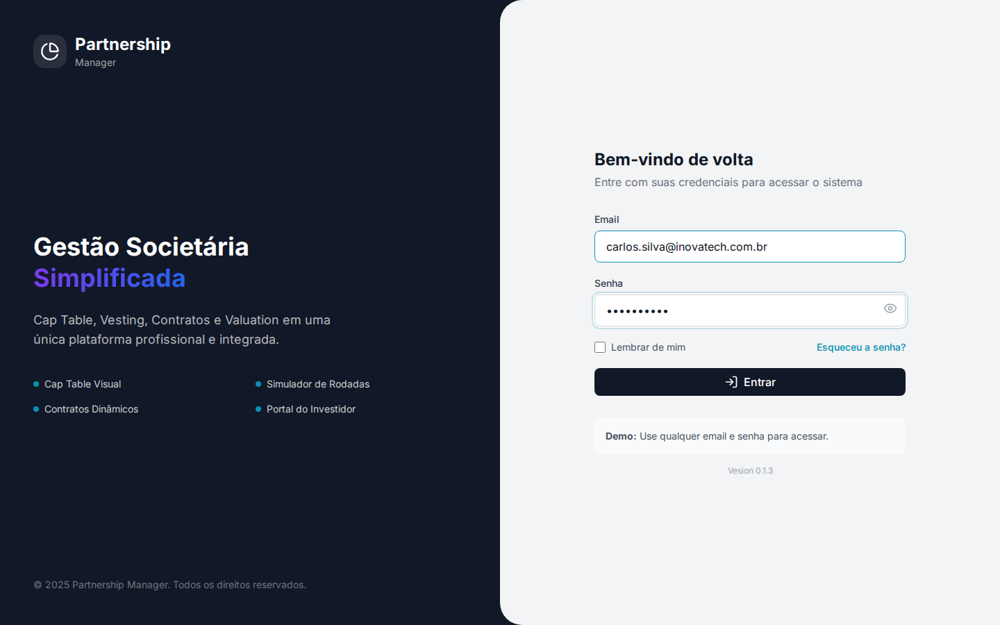

---

## 2. Dashboards

Os Dashboards são painéis de leitura — não permitem edição direta — e servem como ponto de partida para o acompanhamento rápido do estado da empresa. Cada dashboard é segmentado por tema (geral, valuation, financeiro) e por perfil de acesso (usuário comum, investidor).

---

### 2.1 Dashboard Principal

**Rota:** `/dashboard`

**Resumo:** Visão geral e consolidada de toda a empresa em uma única tela.

O Dashboard Principal é a tela central do sistema, projetada para ser o ponto de entrada diário do usuário. Ele reúne, em um único painel, os indicadores e eventos mais relevantes de diferentes módulos, eliminando a necessidade de navegar por várias telas para ter uma visão do estado atual da empresa.

**O que é exibido:**
- **Distribuição do Cap Table:** gráfico de pizza interativo mostrando a participação percentual de cada sócio e classe de ações na empresa.
- **Eventos de vesting próximos:** lista dos grants com datas de aquisição iminentes, facilitando o acompanhamento de obrigações com colaboradores e sócios.
- **Últimas comunicações:** resumo dos comunicados mais recentes publicados para a empresa ou para os investidores.
- **Alertas de ação pendente:** avisos destacados para contratos aguardando assinatura, fluxos de aprovação pendentes e notificações não lidas.

**Quando usar:** ao iniciar o dia de trabalho, como ponto de verificação rápida, ou sempre que precisar de uma visão consolidada sem entrar nos módulos específicos.

> **Perfis que utilizam:** Admin, Founder, BoardMember, Finance, Legal, HR.

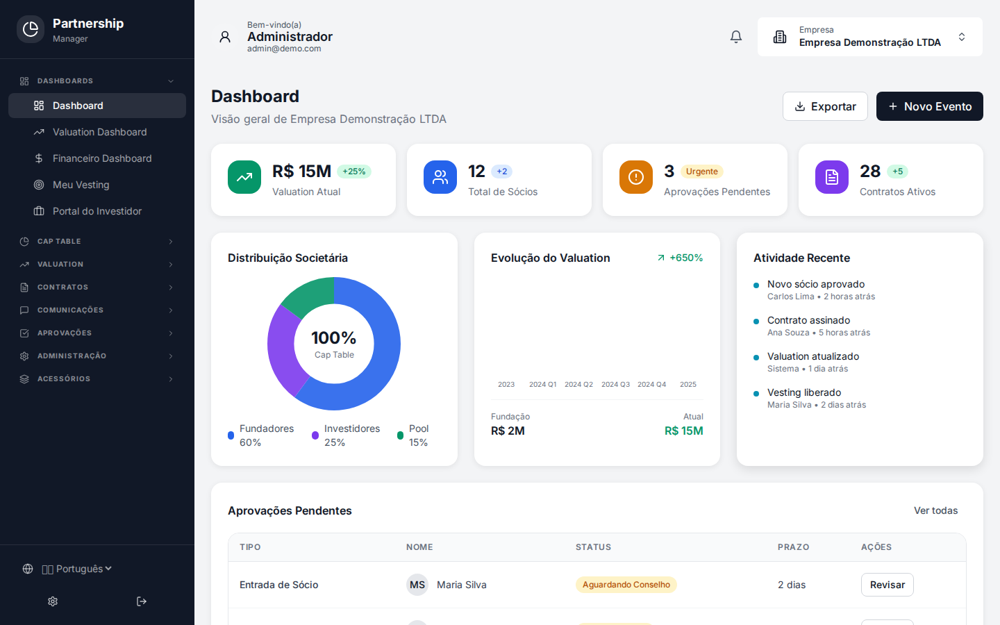

---

### 2.2 Valuation Dashboard

**Rota:** `/valuations/dashboard`

**Resumo:** Painel analítico para acompanhar a evolução do valor da empresa ao longo do tempo.

O Valuation Dashboard transforma os dados dos valuations registrados no sistema em visualizações gráficas de fácil leitura. Em vez de consultar cada avaliação individualmente, este painel concentra a inteligência histórica do valuation em uma única tela comparativa.

**O que é exibido:**
- **Evolução histórica:** gráfico de linha mostrando como o valor da empresa cresceu (ou variou) de rodada em rodada, desde o primeiro valuation registrado até o mais recente.
- **Comparação entre metodologias:** visão paralela dos valores calculados por diferentes métodos (DCF, Múltiplos de Mercado, Berkus, Scorecard, First Chicago e fórmulas customizadas), permitindo entender a variação entre abordagens.
- **Métricas-chave por rodada:** Pré-Money (valor antes do aporte), Pós-Money (valor após o aporte) e percentual de diluição dos sócios existentes em cada round.

**Quando usar:** ao preparar reuniões com investidores, ao analisar o impacto de uma nova rodada de captação, ou ao apresentar a evolução de valor para o conselho.

> **Perfis que utilizam:** Admin, Founder, BoardMember, Finance.

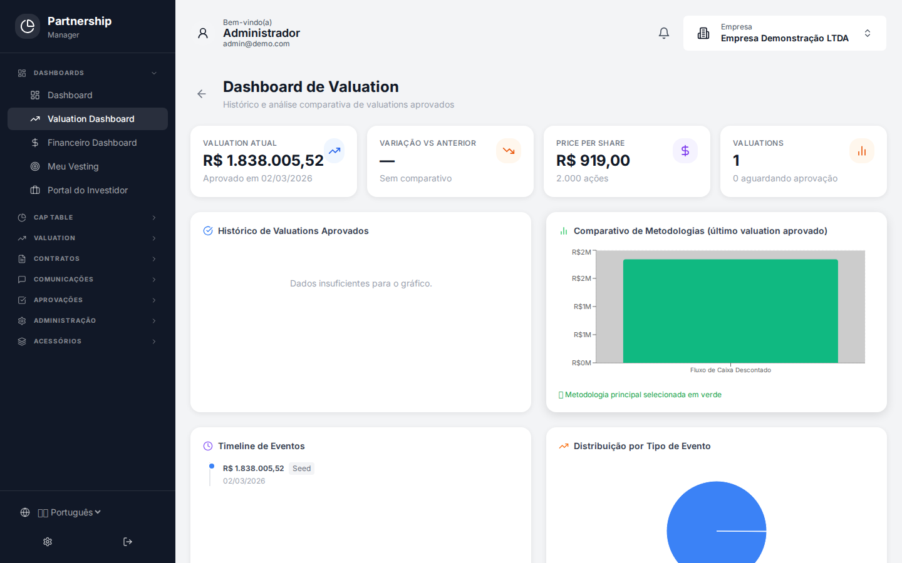

---

### 2.3 Financeiro Dashboard

**Rota:** `/financial/dashboard`

**Resumo:** Indicadores financeiros consolidados da empresa para acompanhamento de saúde do negócio.

O Financeiro Dashboard apresenta os números financeiros da empresa de forma visual e resumida, consumindo os dados inseridos no módulo Financeiro (seção 4.2). É o painel ideal para gestores que precisam de uma leitura rápida dos resultados sem abrir planilhas ou relatórios detalhados.

**O que é exibido:**
- **Receita Recorrente Mensal (MRR):** principal indicador de saúde financeira de empresas de receita recorrente, mostrando a variação mês a mês.
- **Despesas por período:** visão das saídas financeiras agrupadas por categoria e período, facilitando o controle de custos.
- **Balanço por período:** resultado entre receitas e despesas, indicando lucro ou prejuízo operacional por mês/ano.
- **Indicadores de saúde financeira:** métricas como ARR (Receita Recorrente Anual), churn estimado e runway (tempo de caixa disponível), quando configurados.

**Quando usar:** em reuniões de resultado, ao fechar o mês, ao preparar relatórios para investidores ou ao alimentar modelos de valuation.

> **Perfis que utilizam:** Admin, Founder, Finance, BoardMember.

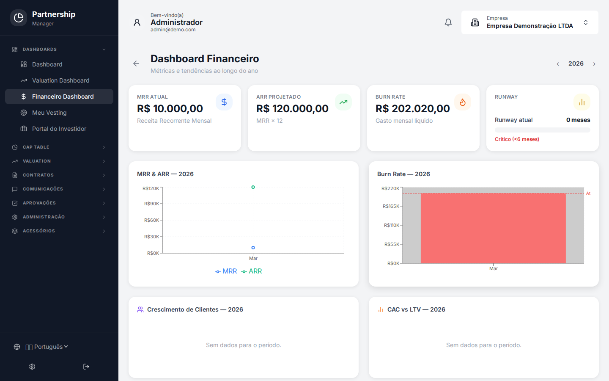

---

### 2.4 Meu Vesting

**Rota:** `/my-vesting`

**Resumo:** Visão individual e personalizada do colaborador sobre seus próprios grants de vesting.

Esta tela é voltada exclusivamente para o usuário logado — cada pessoa vê apenas seus próprios dados de vesting, sem acesso às informações de outros colaboradores. O objetivo é dar transparência total ao colaborador sobre o andamento da sua participação na empresa.

**O que é exibido:**
- **Percentual adquirido (vested):** quanto já foi conquistado do total concedido, em quantidade e percentual.
- **Status do cliff:** se o período de carência (cliff) ainda está em curso, exibe os dias ou meses restantes até o primeiro vesting; se já passou, indica a data em que foi atingido.
- **Calendário de aquisição futura:** linha do tempo interativa mostrando quando ocorrerão os próximos eventos de vesting — mês a mês, trimestre a trimestre ou conforme as regras do plano.
- **Valor estimado das cotas:** cálculo automático do valor financeiro das cotas já adquiridas e a adquirir, com base no último valuation registrado para a empresa.

**Quando usar:** quando o colaborador quiser entender o estado atual das suas opções/ações, planejar exercício de opções ou simplesmente acompanhar o próprio progresso no plano de equity.

> **Perfis que utilizam:** Employee, HR e qualquer usuário que possua grants de vesting.

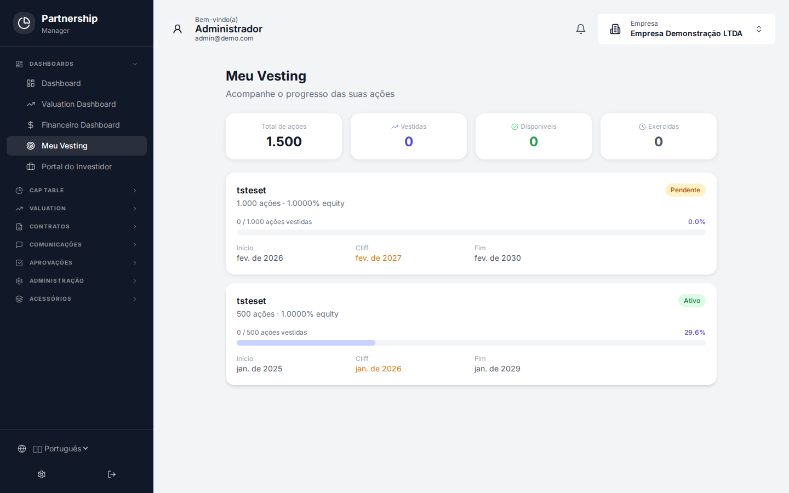

---

### 2.5 Portal do Investidor

**Rota:** `/investor`

**Resumo:** Interface simplificada e focada para investidores acompanharem sua participação e as novidades da empresa.

O Portal do Investidor é uma visão curada do sistema, projetada para oferecer ao investidor exatamente as informações de que precisa, sem expor dados operacionais internos que não são de sua alçada. O acesso é controlado pelo perfil "Investor" e os dados exibidos são filtrados para o portfólio daquele investidor específico.

**O que é exibido:**
- **Portfólio de participações:** resumo das empresas e percentuais em que o investidor possui participação, com evolução ao longo do tempo.
- **Comunicações da empresa:** últimos comunicados publicados com visibilidade para investidores — relatórios de resultado, atualizações estratégicas, anúncios.
- **Eventos de vesting relevantes:** grants associados ao próprio investidor, quando aplicável.
- **Valuations compartilhados:** avaliações que a empresa decidiu compartilhar com os investidores, com os principais indicadores.
- **Documentos do Data Room:** acesso aos documentos disponibilizados no Data Room com permissão para investidores.

**Quando usar:** o investidor acessa este portal para se manter atualizado sobre o portfólio, baixar documentos de due diligence ou acompanhar o crescimento da empresa investida.

> **Perfis que utilizam:** Investor (acesso restrito ao próprio portfólio).

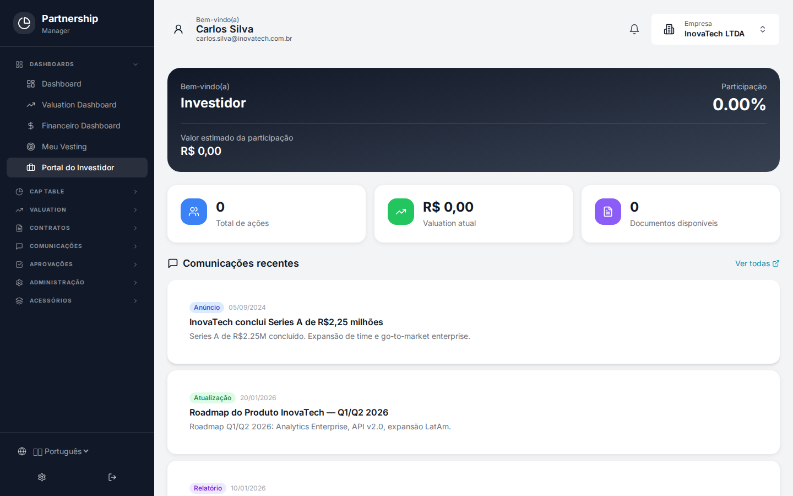

---

## 3. Cap Table

O módulo Cap Table é o coração do sistema. Aqui ficam registradas todas as informações societárias da empresa: quem são os sócios, qual a participação de cada um, como essas participações mudaram ao longo do tempo e quais planos de vesting existem para distribuição futura de equity.

---

### 3.1 Empresas

**Rota:** `/companies`

**Resumo:** Cadastro e gerenciamento das empresas gerenciadas pela plataforma.

Esta tela lista todas as empresas registradas no sistema. O Partnership Manager opera em modo multi-tenant: cada empresa é um ambiente isolado com seu próprio Cap Table, seus usuários, suas configurações e seus dados financeiros. Nenhuma empresa tem acesso aos dados de outra.

**Funcionalidades disponíveis:**
- **Criar empresa:** registrar uma nova empresa informando razão social, CNPJ, endereço, segmento e responsável principal. A empresa criada estará disponível para seleção no contexto de todos os outros módulos.
- **Editar empresa:** atualizar dados cadastrais como endereço, responsável ou informações de contato.
- **Inativar empresa:** desativar uma empresa sem excluir seus dados permanentemente. Empresas inativas não aparecem nas listagens padrão, mas seus registros históricos são preservados.
- **Selecionar empresa ativa:** em ambientes com múltiplas empresas, permite alternar o contexto de trabalho para uma empresa específica.

**Quando usar:** ao incorporar uma nova empresa ao sistema, ao atualizar dados cadastrais, ou ao gerenciar um grupo empresarial com múltiplas entidades.

> **Perfis que utilizam:** SuperAdmin, Admin.

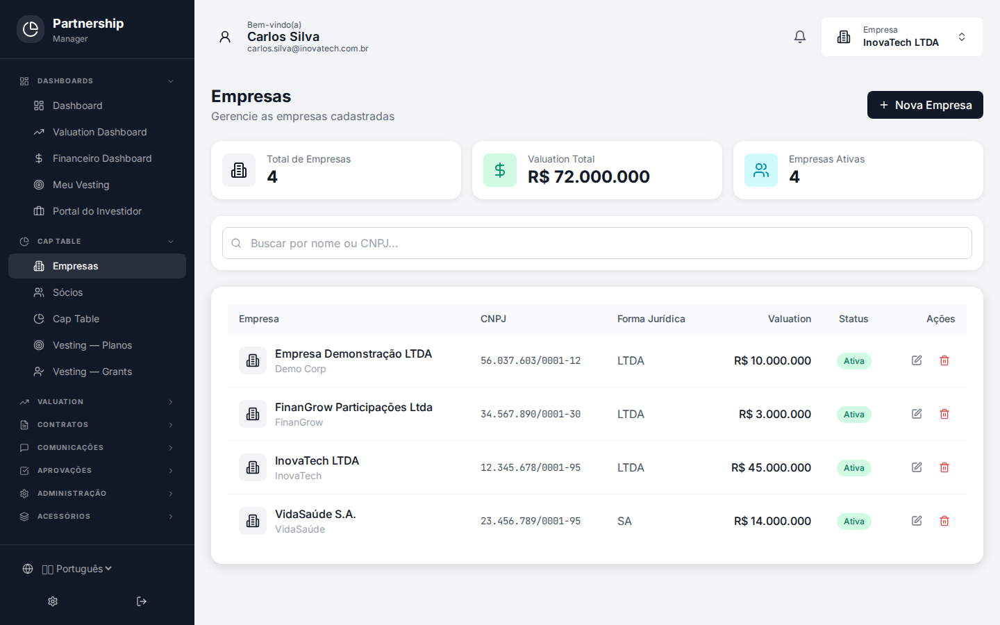

---

### 3.2 Sócios

**Rota:** `/shareholders`

**Resumo:** Cadastro completo dos acionistas e sócios da empresa com visão de participação e histórico.

A tela de Sócios lista todos os detentores de participação na empresa — sejam fundadores, investidores pessoa física, fundos de investimento (pessoa jurídica), colaboradores com equity ou detentores de opções. É o registro mestre de quem compõe o quadro societário.

**Funcionalidades disponíveis:**
- **Cadastro de sócio:** registrar pessoas físicas (CPF, dados pessoais) ou jurídicas (CNPJ, razão social), com dados de contato e documentos vinculados.
- **Participação atual:** exibição do percentual e quantidade de ações/cotas que cada sócio detém no momento, calculado automaticamente com base nas transações registradas.
- **Classe de ações detidas:** indicação das classes de ações de cada sócio (Ordinárias, Preferenciais, SAFE, Opções), com o volume em cada classe.
- **Histórico de investimentos:** linha do tempo das transações que envolveram aquele sócio — aportes realizados, transferências recebidas, exercício de opções.
- **Documentos vinculados:** acesso rápido a contratos de investimento, acordos de sócios e outros documentos associados ao sócio.

**Quando usar:** ao admitir um novo sócio ou investidor, ao atualizar dados de um acionista existente, ou ao consultar o perfil completo de um detentor de participação.

> **Perfis que utilizam:** Admin, Founder, Legal, BoardMember.

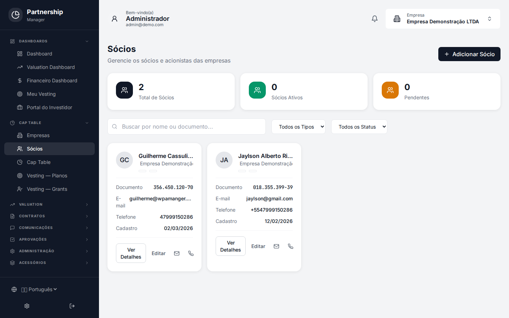

---

### 3.3 Cap Table

**Rota:** `/cap-table`

**Resumo:** Tabela de capitalização em tempo real com a estrutura completa de ações da empresa.

O Cap Table (tabela de capitalização) é o documento mais importante de uma empresa para efeitos societários. Ele registra, de forma precisa e atualizada, quem são os detentores de participação, quantas ações cada um possui, em que classe e qual o percentual resultante. O sistema calcula e mantém este documento automaticamente com base nas transações registradas.

**Funcionalidades disponíveis:**
- **Visão por classe de ação:** listagem separada por tipo (Ações Ordinárias, Preferenciais Série A, Preferenciais Série B, SAFEs, Notas Conversíveis, Opções Emitidas, etc.), com totais por classe.
- **Participação percentual:** cálculo automático e atualizado do percentual fully-diluted (considerando opções ainda não exercidas) e basic (somente ações emitidas).
- **Gráfico de distribuição:** pizza interativa que ilustra visualmente como está dividido o capital entre os sócios e classes.
- **Diluição:** simulação e visualização de como novas emissões ou conversões afetariam a participação dos sócios atuais.

**Quando usar:** em due diligences, ao preparar uma nova rodada de investimento, ao responder perguntas de sócios sobre participação; ou como fonte oficial de dados societários em auditorias e assembleias.

> **Perfis que utilizam:** Admin, Founder, BoardMember, Legal, Investor (visualização).

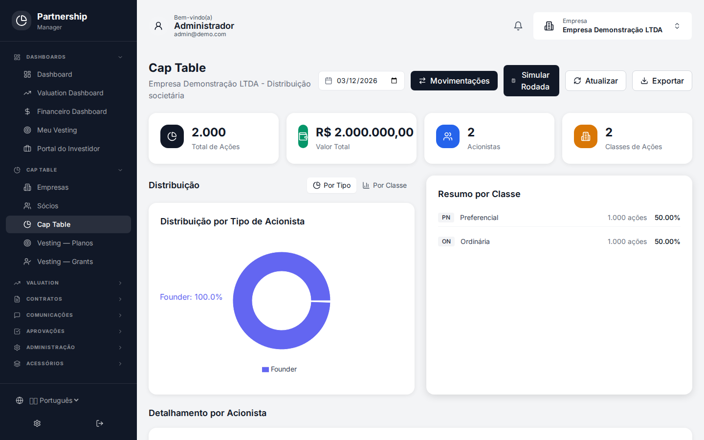

---

### 3.4 Transações

**Rota:** `/cap-table/transactions`

**Resumo:** Registro histórico e auditável de todas as movimentações que alteraram o Cap Table.

Toda mudança no Cap Table — seja uma emissão de novas ações, uma transferência entre sócios, o exercício de uma opção ou a conversão de um SAFE — é registrada como uma transação. Esta tela é o livro-razão societário da empresa: uma trilha de auditoria completa e imutável de toda a história do quadro societário.

**Tipos de transação suportados:**
- **Emissão:** criação de novas ações para um sócio (aporte de capital, fundação, bonificação).
- **Transferência:** movimentação de ações de um titular para outro (compra e venda entre sócios, cessão de cotas).
- **Conversão:** transformação de instrumentos como SAFE ou notas conversíveis em ações preferenciais ou ordinárias.
- **Exercício de opção:** conversão de opções de compra (stock options) em ações efetivas pelo beneficiário.
- **Amortização/Cancelamento:** redução ou extinção de participação.

**Dados registrados por transação:** data, tipo, partes envolvidas, quantidade, valor unitário, valor total e documentos de suporte.

**Quando usar:** ao registrar um novo aporte recebido, ao documentar a transferência de participação entre sócios, ao contabilizar o exercício de opções por colaboradores, ou ao auditar o histórico societário.

> **Perfis que utilizam:** Admin, Founder, Legal.

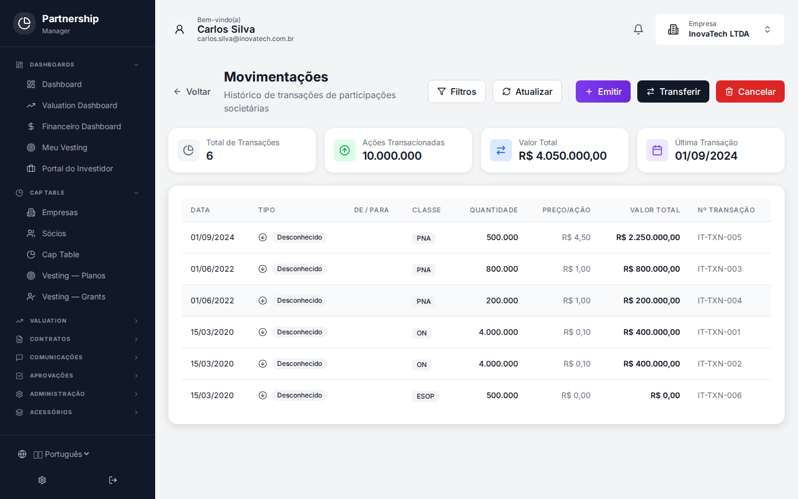

---

### 3.5 Vesting — Planos

**Rota:** `/vesting`

**Resumo:** Criação e gerenciamento das regras dos planos de vesting da empresa.

Um plano de vesting define as *regras* pelas quais colaboradores ou sócios adquirem progressivamente sua participação ao longo do tempo ou em função de eventos. Esta tela gerencia os modelos de plano — que depois são aplicados individualmente em forma de Grants (seção 3.6).

**Funcionalidades disponíveis:**
- **Cliff:** período inicial após o qual o primeiro lote de vesting ocorre. Por exemplo: em um plano com cliff de 12 meses, o beneficiário não recebe nada antes de completar 1 ano; ao completar 1 ano, recebe o percentual referente ao período acumulado.
- **Período total:** duração completa do vesting. Planos típicos variam de 2 a 5 anos.
- **Frequência de aquisição:** ritmo em que as cotas são liberadas após o cliff — mensal, trimestral ou anual.
- **Condições especiais:** possibilidade de configurar regras de aceleração automática em eventos específicos, como venda da empresa (single trigger) ou combinação de saída + mudança de controle (double trigger).
- **Vesting por milestone:** planos condicionados a marcos estratégicos (lançamento de produto, atingimento de receita) em vez de tempo, utilizando os Templates de Milestone da seção 9.3.

**Quando usar:** ao estruturar um programa de equity para colaboradores, ao criar planos específicos para fundadores ou ao definir os termos de participação de um novo sócio estratégico.

> **Perfis que utilizam:** Admin, Founder, HR, Legal.

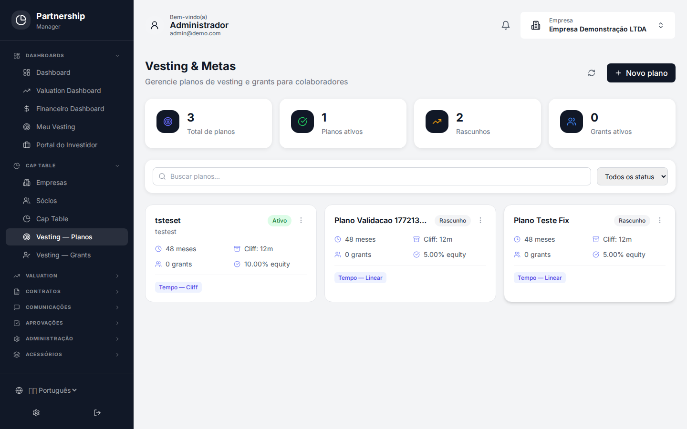

---

### 3.6 Vesting — Grants

**Rota:** `/vesting/grants`

**Resumo:** Concessões individuais de opções ou ações vinculadas a um plano de vesting para cada beneficiário.

Se os Planos (3.5) definem as regras, os Grants são a aplicação dessas regras para uma pessoa específica. Cada Grant é um contrato individual que diz: "o colaborador X recebe Y unidades de opções/ações seguindo as regras do Plano Z, com início em tal data".

**Informações por grant:**
- **Beneficiário:** o usuário ou sócio que receberá as cotas.
- **Plano associado:** qual conjunto de regras (cliff, duração, frequência) rege este grant.
- **Data de início:** quando começa a contagem do vesting para este beneficiário.
- **Quantidade total concedida:** total de opções ou ações prometidas ao término do período.
- **Quantidade já adquirida (vested):** quanto já foi liberado para o beneficiário até a data atual.
- **Saldo restante:** quantidade ainda a ser adquirida nos períodos futuros.
- **Status:** ativo, suspenso, cancelado ou totalmente adquirido.

**Quando usar:** ao integrar um novo colaborador com equity, ao formalizar a concessão de opções para um executivo, ou ao acompanhar o andamento coletivo de todos os grants ativos.

> **Perfis que utilizam:** Admin, HR, Legal (gestão); Employee (leitura do próprio grant via Meu Vesting).

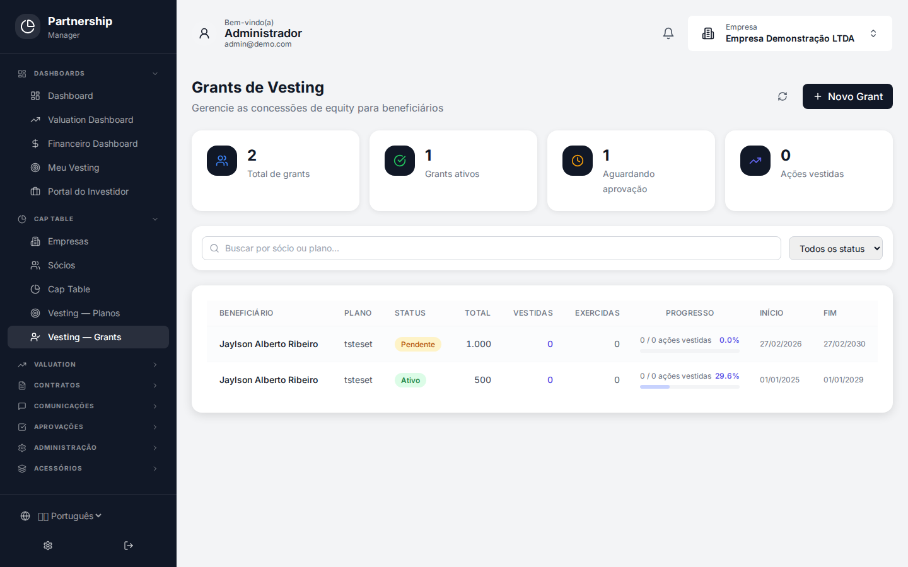

---

## 4. Valuation

O módulo de Valuation concentra todas as avaliações econômicas da empresa e os dados financeiros que as sustentam. Aqui é onde a empresa documenta quanto vale em cada rodada, por qual método e com base em quais premissas.

---

### 4.1 Valuation

**Rota:** `/valuations`

**Resumo:** Registro e comparação de todas as avaliações de valor da empresa ao longo das rodadas.

Esta tela lista todos os valuations realizados para a empresa, organizados por data. Cada avaliação é um registro formal do valor econômico da empresa em um momento específico — fundamental para negociações com investidores, cálculo de diluição, precificação de opções e relatórios financeiros.

**Métodos de avaliação suportados:**
- **DCF (Fluxo de Caixa Descontado):** projeção de receitas e despesas futuras trazidas a valor presente por uma taxa de desconto. Exige dados financeiros cadastrados no módulo Financeiro.
- **Múltiplos de Mercado:** comparação com empresas similares listadas ou com transações recentes do setor (ex.: múltiplo de receita, EBITDA ou usuários).
- **Método Berkus:** avaliação qualitativa baseada em cinco fatores de risco/valor para startups em estágio inicial, sem histórico financeiro robusto.
- **Scorecard:** comparação com empresas de referência ajustada por fatores como time, produto, mercado e tração.
- **First Chicago:** média ponderada de três cenários (otimista, base, pessimista), adequada para empresas com incerteza sobre o crescimento futuro.
- **Fórmulas customizadas:** métodos próprios da empresa definidos na seção 9.1.

**Quando usar:** ao fechar uma rodada de investimento, ao preparar o relatório anual para o conselho, ao calcular o preço de exercício de opções para um novo plano de vesting, ou ao documentar formalmente o valor da empresa em uma data específica.

> **Perfis que utilizam:** Admin, Founder, Finance, BoardMember.

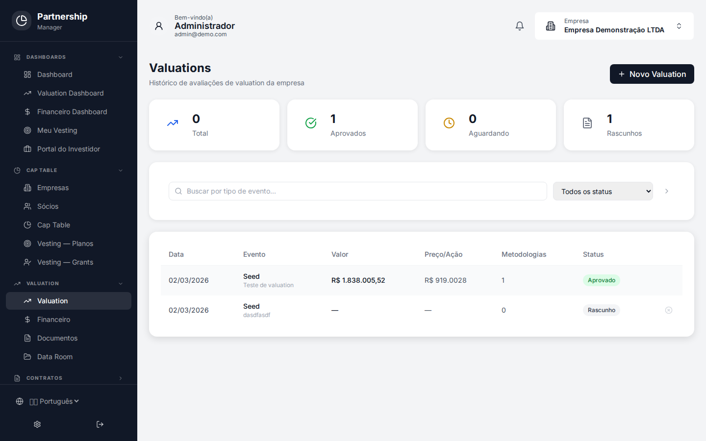

---

### 4.2 Financeiro

**Rota:** `/financial`

**Resumo:** Lançamento e gestão dos dados financeiros da empresa por período para alimentar valuations e dashboards.

O módulo Financeiro é o repositório de dados econômicos da empresa organizados por competência (mês/ano). Esses dados são consumidos pelo Valuation Dashboard (2.3) e pelos modelos de avaliação que dependem de histórico financeiro, como o DCF.

**Funcionalidades disponíveis:**
- **Receitas por período:** registro das fontes de receita (MRR, receita pontual, outras entradas) para cada mês ou ano.
- **Despesas por período:** categorização de saídas (pessoal, infraestrutura, marketing, etc.) para controle de custos e projeção de burn rate.
- **Indicadores derivados:** o sistema calcula automaticamente MRR, ARR, margem bruta e outros KPIs financeiros com base nos lançamentos feitos.
- **Importação de dados:** possibilidade de inserir dados financeiros em lote, facilitando a sincronização com planilhas ou sistemas contábeis existentes.

**Quando usar:** mensalmente, ao fechar o período financeiro, inserir os resultados reais da empresa; e antes de realizar um novo valuation por DCF, garantindo que os dados financeiros estejam atualizados.

> **Perfis que utilizam:** Admin, Finance, Founder.

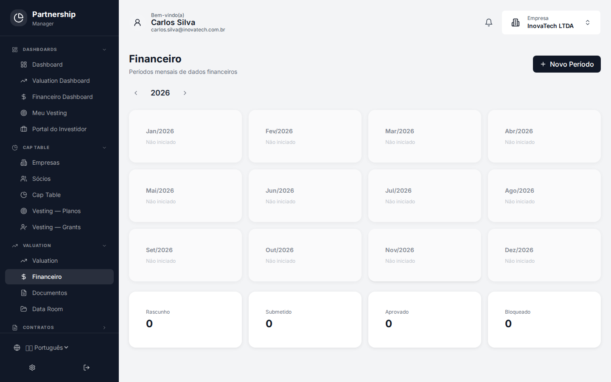

---

### 4.3 Documentos

**Rota:** `/documents`

**Resumo:** Repositório centralizado de documentos da empresa com controle de versão e acesso por perfil.

O módulo de Documentos funciona como o arquivo digital oficial da empresa. Todos os documentos relevantes — contratos digitalizados, laudos de valuation, atas de assembleia, acordos de sócios, comprovantes de aportes — são armazenados aqui de forma organizada e segura.

**Funcionalidades disponíveis:**
- **Upload e categorização:** envio de arquivos em diversos formatos (PDF, DOCX, XLSX, imagens) com classificação por categoria (contrato, financeiro, jurídico, técnico, etc.) e vinculação com um módulo do sistema (sócio, valuation, grant, etc.).
- **Controle de versão:** ao atualizar um documento, a versão anterior é preservada no histórico, permitindo consultar versões anteriores sem perder o registro.
- **Controle de acesso:** documentos podem ser marcados como confidenciais, restritos a determinados perfis (ex.: apenas Admin e Legal podem visualizar o laudo de valuation completo).
- **Download e pré-visualização:** acesso rápido ao conteúdo dos documentos sem sair do sistema.
- **Busca e filtros:** localização de documentos por nome, categoria, data ou módulo vinculado.

**Quando usar:** ao receber um contrato assinado para arquivar, ao registrar documentos de uma rodada de investimento, ao organizar a documentação societária para uma auditoria, ou ao compartilhar documentos com sócios de forma controlada.

> **Perfis que utilizam:** Admin, Legal, Finance (conforme permissão do documento).

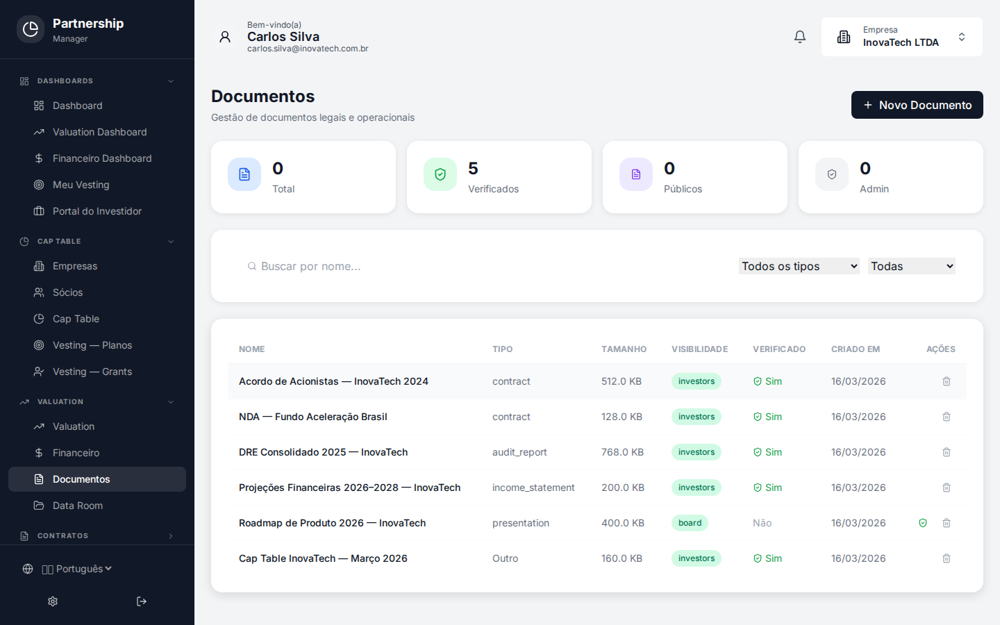

---

### 4.4 Data Room

**Rota:** `/dataroom`

**Resumo:** Espaço virtual seguro para compartilhamento de documentos confidenciais com investidores e partes externas.

O Data Room é um ambiente separado e com controle granular de visibilidade, criado especificamente para processos que exigem compartilhamento controlado de informações sensíveis — como due diligences, captações de rodadas e negociações de M&A. A diferença em relação ao módulo Documentos é que o Data Room é voltado para acesso externo protocolado, não para armazenamento interno.

**Funcionalidades disponíveis:**
- **Organização em pastas:** estrutura hierárquica de diretórios temáticos (ex.: Financeiro, Jurídico, Tecnologia, Cap Table, Contratos).
- **Controle de visibilidade por pasta/documento:** cada item pode ser configurado com três níveis de acesso: `Interno` (apenas equipe da empresa), `Investidores` (sócios e investidores com perfil ativo no sistema) ou `Público` (qualquer pessoa com acesso ao link).
- **Registro de acesso:** o sistema registra quem visualizou cada documento e quando, criando um log de auditoria útil em negociações.
- **Publicação seletiva:** é possível criar versões do data room com conjuntos diferentes de documentos para diferentes grupos de investidores.

**Quando usar:** ao abrir um processo formal de captação de investimento, ao responder a um pedido de due diligence de um potencial investidor ou parceiro, ou ao preparar documentação para uma saída (IPO, fusão, aquisição).

> **Perfis que utilizam:** Admin, Founder (gestão); Investor, BoardMember (visualização conforme permissão).

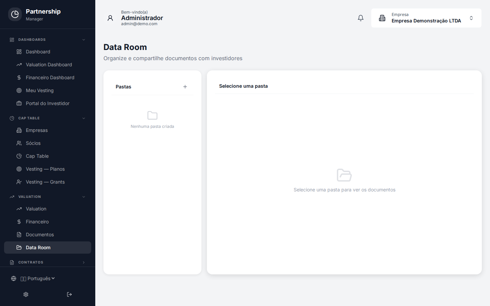

---

## 5. Contratos

O módulo de Contratos gerencia todo o ciclo de vida dos documentos contratuais da empresa — desde a criação até a assinatura e arquivamento — com rastreabilidade completa e suporte a templates reutilizáveis.

---

### 5.1 Contratos

**Rota:** `/contracts`

**Resumo:** Gerenciamento completo do ciclo de vida dos contratos, do rascunho à assinatura e arquivamento.

Esta tela centraliza todos os contratos da empresa — acordos de sócios, contratos de vesting, term sheets, acordos de confidencialidade (NDA), contratos de prestação de serviço, entre outros. O sistema oferece controle de status em cada etapa do processo contratual.

**Ciclo de vida de um contrato:**
1. **Rascunho:** contrato criado a partir de um template ou do zero, ainda em fase de elaboração.
2. **Em revisão:** contrato enviado para revisão jurídica ou de outra parte antes de ser finalizado.
3. **Aguardando assinatura:** contrato aprovado e enviado para assinatura das partes envolvidas.
4. **Assinado:** contrato com todas as assinaturas coletadas, arquivado como documento oficial.
5. **Vencido:** contratos com prazo de vigência encerrado ou que não foram assinados no prazo estipulado.

**Funcionalidades disponíveis:**
- **Criação a partir de template:** uso dos modelos da seção 5.2, com preenchimento automático de variáveis (nome do sócio, data, percentual, etc.).
- **Vinculação com outros módulos:** associar o contrato a um sócio específico, a um grant de vesting ou a uma rodada de investimento, para rastreabilidade cruzada.
- **Controle de versões:** cada revisão do contrato é salva como versão separada, preservando o histórico de alterações.
- **Filtros avançados:** localizar contratos por status, partes envolvidas, tipo e período.

**Quando usar:** ao formalizar um novo investimento, ao emitir contratos de vesting para colaboradores, ao registrar acordos entre sócios, ou ao renovar contratos próximos ao vencimento.

> **Perfis que utilizam:** Admin, Legal, Founder.

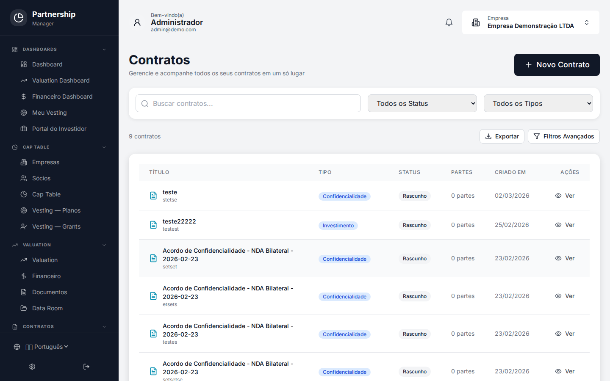

---

### 5.2 Templates de Contratos

**Rota:** `/contracts/templates` *(requer perfil Admin ou Legal)*

**Resumo:** Biblioteca de modelos reutilizáveis para padronizar e agilizar a criação de contratos.

Os Templates de Contratos são modelos pré-redigidos com estrutura fixa e campos variáveis. Em vez de criar cada contrato do zero, o usuário seleciona o template adequado e o sistema preenche automaticamente as informações já cadastradas no sistema (nome do sócio, CNPJ, percentual de participação, data do grant, etc.).

**Funcionalidades disponíveis:**
- **Criação e edição de templates:** definir o texto base do contrato com marcadores de variáveis (ex.: `{{nome_socio}}`, `{{data_inicio}}`, `{{percentual_participacao}}`).
- **Cláusulas dinâmicas:** inserir cláusulas da biblioteca de Cláusulas (seção 9.2) no template, permitindo que alterações centralizadas em uma cláusula se propaguem automaticamente para todos os templates que a utilizam.
- **Categorização:** organizar os templates por tipo (acordo de sócios, contrato de vesting, NDA, etc.) para fácil localização.
- **Versionamento de templates:** manter versões históricas do modelo para garantir que contratos gerados no passado possam ser reproduzidos fielmente.

**Quando usar:** ao definir os modelos padrão da empresa para cada tipo de contrato; ao atualizar uma cláusula recorrente que precisa ser alterada em múltiplos contratos de uma vez; ou ao criar templates específicos para cada série de investimento.

> **Perfis que utilizam:** Admin, Legal.

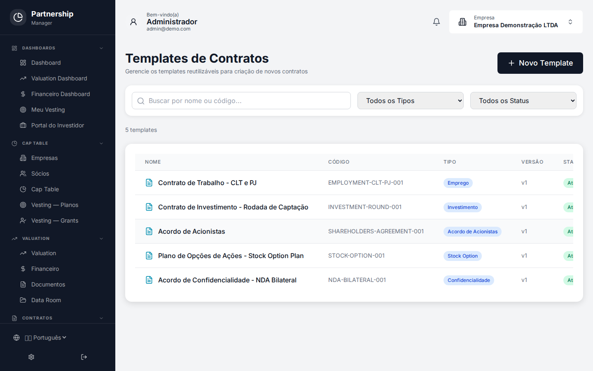

---

## 6. Comunicações

O módulo de Comunicações gerencia o fluxo de informação entre a empresa, seus sócios e seus investidores, garantindo que as comunicações certas cheguem às pessoas certas no momento adequado.

---

### 6.1 Comunicações

**Rota:** `/communications`

**Resumo:** Central para criação, agendamento e publicação de comunicados para sócios e investidores.

Esta tela é o canal oficial de comunicação da empresa com seu quadro societário. Em vez de enviar informações por e-mail avulso ou WhatsApp — sem registro e sem controle de quem recebeu — o sistema centraliza todos os comunicados em um único lugar, com histórico permanente e controle de visibilidade.

**Tipos de comunicado suportados:**
- **Anúncios:** comunicações pontuais sobre eventos relevantes (fechamento de rodada, entrada de novo sócio, prêmio conquistado).
- **Relatórios:** atualizações periódicas de resultados (relatório mensal, trimestral ou anual para investidores).
- **Alertas:** avisos de prazo ou ação necessária (data-limite de assinatura, assembleia marcada).
- **Atualizações estratégicas:** comunicados sobre mudanças de direção, novos produtos ou decisões do conselho.

**Funcionalidades disponíveis:**
- **Controle de visibilidade:** cada comunicado pode ser direcionado para grupos específicos — todos os usuários, somente investidores, somente fundadores, somente colaboradores, ou uma combinação.
- **Rascunho e agendamento:** preparar comunicados com antecedência e agendar a publicação para uma data/hora específica.
- **Fixar posts importantes:** destacar comunicados prioritários no topo da listagem para todos os destinatários.
- **Notificação automática:** ao publicar, o sistema gera notificações automáticas para todos os destinatários configurados.

**Quando usar:** ao divulgar resultados financeiros do trimestre para investidores, ao comunicar o fechamento de uma rodada, ao notificar sócios sobre uma assembleia, ou ao compartilhar marcos importantes da empresa.

> **Perfis que utilizam:** Admin, Founder (publicação); todos os perfis com permissão configurada (leitura).

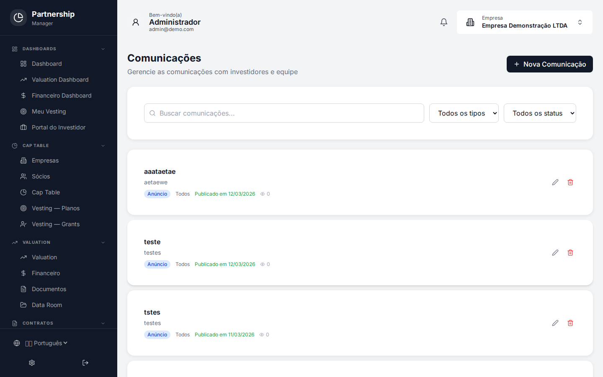

---

### 6.2 Notificações

**Rota:** `/notifications`

**Resumo:** Central pessoal de alertas e notificações recebidas pelo usuário logado.

As Notificações são geradas automaticamente pelo sistema em resposta a eventos que requerem atenção ou que são relevantes para o usuário logado. Enquanto Comunicações (6.1) são mensagens criadas manualmente por usuários, as Notificações são acionadas por gatilhos automáticos do sistema.

**Eventos que geram notificações automáticas:**
- Publicação de um novo comunicado com visibilidade para o perfil do usuário.
- Atribuição de um fluxo de aprovação que requer ação do usuário.
- Contrato enviado para assinatura que inclui o usuário como signatário.
- Evento de vesting do usuário ocorrendo nos próximos dias.
- Prazo de um fluxo de aprovação próximo ao vencimento.
- Respostas ou comentários em aprovações das quais o usuário faz parte.

**Funcionalidades disponíveis:**
- **Indicador de não lidas:** contador visível no menu lateral com a quantidade de notificações pendentes de leitura.
- **Marcar como lida individualmente:** ao clicar em uma notificação, ela é marcada como lida e pode redirecionar para a tela relevante.
- **Marcar tudo como lido:** ação em lote para limpar todas as notificações pendentes de uma vez.
- **Histórico completo:** todas as notificações são mantidas no histórico, mesmo depois de lidas.

**Quando usar:** sempre que o ícone de notificações indicar pendências, ou ao começar o dia para verificar eventos que requerem ação.

> **Perfis que utilizam:** todos os usuários (cada um vê apenas suas próprias notificações).

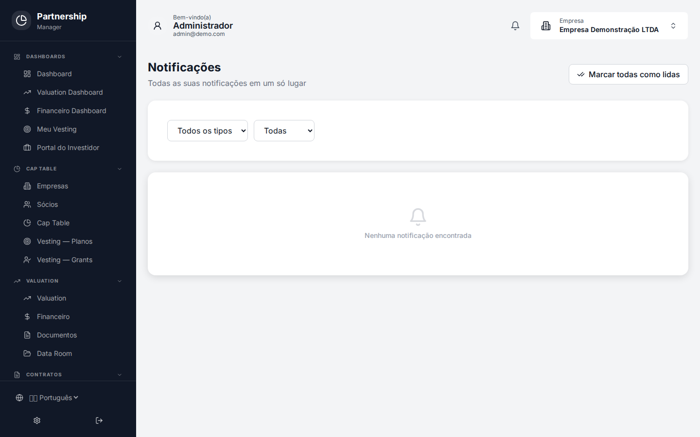

---

## 7. Aprovações

O módulo de Aprovações implementa processos formais de revisão e autorização para decisões importantes da empresa — garantindo que ações críticas passem pelos responsáveis corretos antes de serem executadas.

---

### 7.1 Fluxos de Aprovação

**Rota:** `/approvals/flows`

**Resumo:** Criação e configuração de fluxos de aprovação multi-etapas para processos formais da empresa.

Um Fluxo de Aprovação define a sequência de passos que um documento ou decisão deve percorrer antes de ser considerado aprovado. Esta tela é onde os administradores modelam esses fluxos, definindo quem aprova o quê e em qual ordem.

**Estrutura de um fluxo:**
- **Etapas sequenciais:** cada fluxo é composto por uma ou mais etapas que ocorrem em ordem. Somente após a aprovação de uma etapa o fluxo avança para a próxima.
- **Tipo por etapa:** cada etapa pode ser classificada como `Aprovação` (requer decisão ativa), `Revisão` (verificação sem aprovação formal), `Notificação` (apenas informa sem exigir ação) ou `Automático` (processamento sem intervenção humana).
- **Responsável por papel:** em vez de fixar um usuário específico, cada etapa é atribuída a um papel (Admin, Legal, Finance, BoardMember), garantindo que o fluxo funcione mesmo com mudança de pessoas.
- **Prazo por etapa:** cada etapa tem um SLA individual. O prazo total do fluxo é calculado automaticamente pela soma das etapas.
- **Filtros e categorização:** organizar fluxos por tipo (emissão de ações, contrato, distribuição, comunicado), status e prioridade.

**Quando usar:** ao formalizar o processo de aprovação para emissão de novas ações, ao criar um fluxo para contratos acima de determinado valor, ou ao definir o processo de aprovação para comunicados enviados a investidores.

> **Perfis que utilizam:** Admin (criação e gestão).

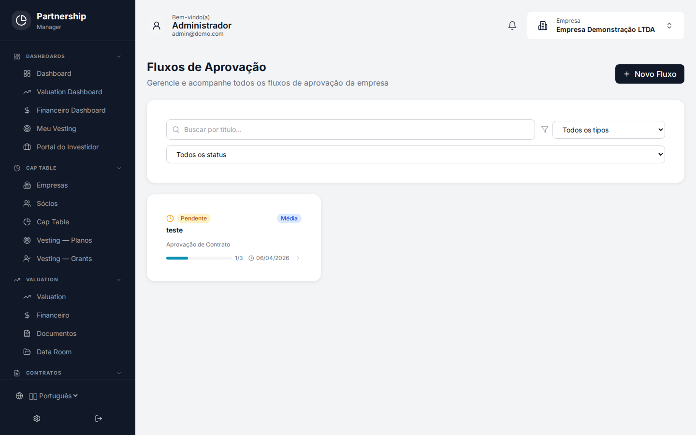

---

### 7.2 Aprovadores

**Rota:** `/approvals/approvers`

**Resumo:** Gerenciamento de quais usuários possuem papel de aprovador e em quais grupos de decisão atuam.

Esta tela responde à pergunta: "quem é responsável por aprovar o quê no sistema?". Ela organiza os usuários aprovadores por papel, tornando transparente quem está alocado em cada grupo de decisão e permitindo ajustes quando há mudança de equipe.

**Funcionalidades disponíveis:**
- **Resumo por papel:** visão consolidada de quantos aprovadores existem em cada papel (Admin, Legal, Finance, BoardMember), com nomes e status.
- **Adicionar aprovador:** conceder a um usuário existente a responsabilidade de aprovação em um determinado papel — útil ao promover alguém para uma função de decisão.
- **Remover aprovador:** revogar a função de aprovação de um usuário sem precisar alterar todos os fluxos que referenciam aquele papel.
- **Verificação de cobertura:** identificar papéis sem aprovadores ativos, o que poderia travar fluxos em andamento.

**Quando usar:** ao integrar um novo membro ao conselho (BoardMember), ao designar um novo responsável jurídico (Legal), ao reorganizar a equipe financeira, ou ao auditar quem tem poder de aprovação no sistema.

> **Perfis que utilizam:** Admin, SuperAdmin.

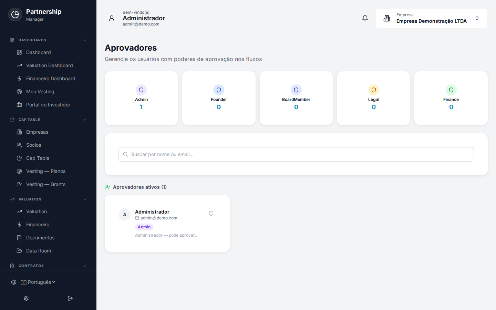

---

### 7.3 Aprovações

**Rota:** `/approvals`

**Resumo:** Fila de aprovações pendentes e visão completa do andamento de todos os fluxos ativos.

Esta é a tela operacional do módulo de Aprovações — onde os aprovadores executam suas ações (aprovar, rejeitar, solicitar alteração) e onde qualquer usuário pode acompanhar o status dos fluxos que envolvem seus documentos ou solicitações.

**Organização em abas:**
- **Pendentes para mim:** aprovações que requerem ação imediata do usuário logado, ordenadas por prazo de vencimento.
- **Em andamento:** fluxos que estão ativos e em alguma etapa intermediária, aguardando outros aprovadores.
- **Aprovados:** histórico de fluxos concluídos com aprovação.
- **Rejeitados:** fluxos que foram negados em alguma etapa, com o motivo registrado.
- **Todos:** visão completa de todos os fluxos, independente de status (disponível para Admin).

**Ações disponíveis por aprovação:**
- **Aprovar:** confirmar a etapa, avançando o fluxo para a próxima etapa ou concluindo o processo.
- **Rejeitar:** negar a solicitação, com campo obrigatório para justificativa que fica registrada no histórico.
- **Solicitar alteração:** devolver o fluxo para o solicitante com comentários específicos sobre o que precisa ser corrigido.
- **Comentar:** adicionar observações ao fluxo sem tomar uma decisão definitiva.

**Quando usar:** diariamente, ao receber uma notificação de aprovação pendente; ou ao acompanhar o status de uma solicitação que o próprio usuário submeteu para aprovação.

> **Perfis que utilizam:** todos os usuários com papel de aprovador (ação); todos os usuários (acompanhamento dos próprios fluxos).

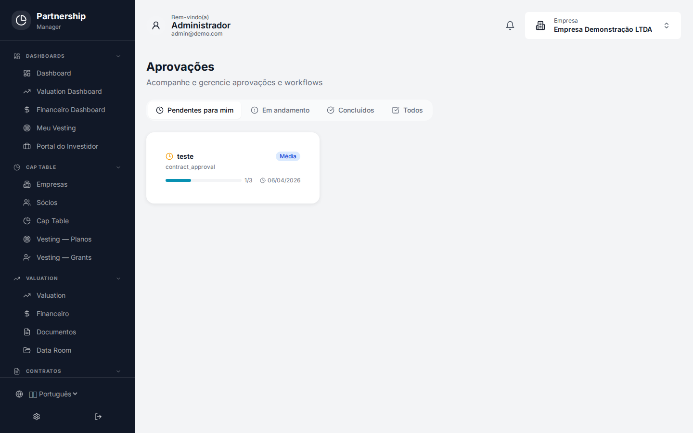

---

## 8. Administração

O módulo de Administração é exclusivo para administradores do sistema e concentra as configurações de acesso — quem pode entrar no sistema e o que cada pessoa pode fazer.

---

### 8.1 Usuários

**Rota:** `/settings/users`

**Resumo:** Cadastro e gestão completa de todos os usuários do sistema, com controle de acesso por perfil.

Esta tela é o ponto central de controle de acesso humano ao sistema. Todo usuário que precisa acessar o Partnership Manager — seja um colaborador, um sócio, um membro do conselho ou um investidor — deve ser cadastrado aqui pelo administrador.

**Funcionalidades disponíveis:**
- **Criar usuário:** registrar um novo usuário informando nome, e-mail (que será o login), empresa associada e papel(éis) inicial(ais).
- **Editar usuário:** atualizar dados como nome, e-mail ou empresa vinculada.
- **Ativar/Inativar:** desativar temporariamente o acesso de um usuário sem excluir sua conta e histórico. Útil em casos de afastamento, rescisão ou mudança de função.
- **Atribuir papéis:** definir quais perfis de acesso o usuário possui — um mesmo usuário pode ter múltiplos papéis (ex.: Founder + Admin), e cada papel concede um conjunto específico de permissões.
- **Busca e filtros:** localizar usuários por nome, e-mail, status (ativo/inativo) ou papel.

**Quando usar:** ao integrar um novo colaborador ou investidor, ao revogar o acesso de alguém que saiu da empresa, ou ao ajustar as permissões de um usuário existente.

> **Perfis que utilizam:** SuperAdmin, Admin.

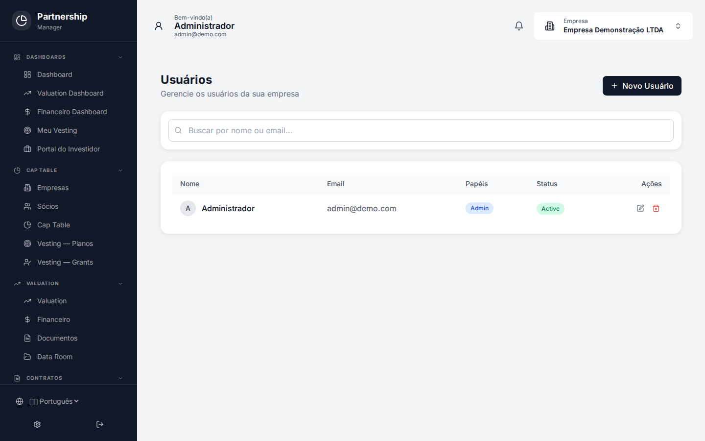

---

### 8.2 Perfis de Acesso

**Rota:** `/settings/roles`

**Resumo:** Visão consolidada de todos os perfis disponíveis e dos usuários alocados em cada um.

Esta tela exibe o mapa completo de papéis do sistema e quantos usuários estão em cada um, funcionando como painel de auditoria de acessos. Cada papel representa um conjunto predefinido de permissões que determina o que o usuário pode ver e fazer no sistema.

**Papéis disponíveis no sistema:**

| Papel | Descrição |
|-------|-----------|
| `SuperAdmin` | Acesso irrestrito a todos os tenants e configurações do sistema. Reservado para a equipe técnica. |
| `Admin` | Administrador da empresa: acesso completo a todos os módulos do tenant. |
| `Founder` | Fundador: acesso amplo a dados societários, financeiros e estratégicos. |
| `BoardMember` | Membro do conselho: acesso de leitura a relatórios, valuations e comunicações; poder de aprovação. |
| `Legal` | Equipe jurídica: gestão de contratos, cláusulas e templates; participação em fluxos de aprovação. |
| `Finance` | Equipe financeira: acesso a dados financeiros, valuations e faturas. |
| `HR` | Recursos humanos: gestão de grants de vesting e dados de colaboradores. |
| `Employee` | Colaborador: acesso restrito ao próprio vesting (Meu Vesting) e comunicações gerais. |
| `Investor` | Investidor: acesso ao Portal do Investidor, comunicações e Data Room conforme configurado. |

**Quando usar:** ao auditar quem tem determinado nível de acesso, ao verificar se um papel tem usuários ativos antes de iniciar um fluxo de aprovação, ou ao planejar uma reorganização de acessos.

> **Perfis que utilizam:** SuperAdmin, Admin.

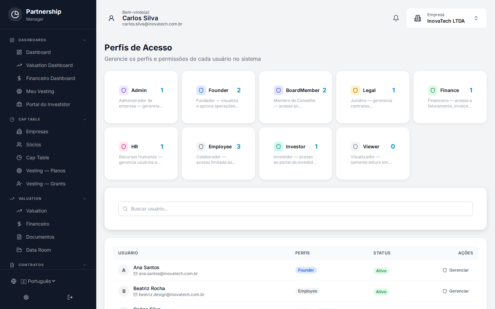

---

## 9. Acessórios

O módulo de Acessórios contém a camada de configuração avançada do sistema — componentes reutilizáveis que alimentam outros módulos e permitem personalizar o sistema para as necessidades específicas da empresa.

---

### 9.1 Fórmulas Customizadas

**Rota:** `/valuations/custom-formulas`

**Resumo:** Criação de metodologias proprietárias de valuation adaptadas à realidade e ao setor da empresa.

Os métodos de valuation padrão do sistema (DCF, Múltiplos, Berkus, etc.) cobrem a maioria dos cenários, mas algumas empresas possuem modelos de negócio específicos que exigem uma abordagem de avaliação proprietária. As Fórmulas Customizadas permitem que a empresa defina sua própria metodologia de cálculo de valor.

**Funcionalidades disponíveis:**
- **Definição de variáveis:** declarar as entradas da fórmula (ex.: `numero_de_assinantes`, `ticket_medio`, `churn_mensal`) com tipo de dado e fonte (manual, calculado de dados financeiros).
- **Expressão matemática:** construir a fórmula combinando variáveis com operações (soma, multiplicação, divisão, exponenciação) e pesos ponderados.
- **Teste da fórmula:** simular o resultado com valores de exemplo antes de publicar a fórmula para uso nos valuations.
- **Disponibilidade:** ao salvar, a fórmula aparece como opção adicional no módulo de Valuation (seção 4.1), podendo ser selecionada junto com os outros métodos.

**Exemplos de uso:**
- Uma empresa de marketplace que avalia pelo GMV (volume bruto transacionado) multiplicado por um múltiplo setorial específico.
- Uma startup de SaaS com uma fórmula baseada em LTV/CAC e coeficiente de crescimento.
- Uma empresa com modelo misto que pondera DCF (60%) com Múltiplos de Receita (40%).

**Quando usar:** ao precisar de um método de avaliação que nenhum dos métodos padrão atende adequadamente; ao apresentar um valuation baseado em métricas proprietárias para um investidor específico.

> **Perfis que utilizam:** Admin, Finance.

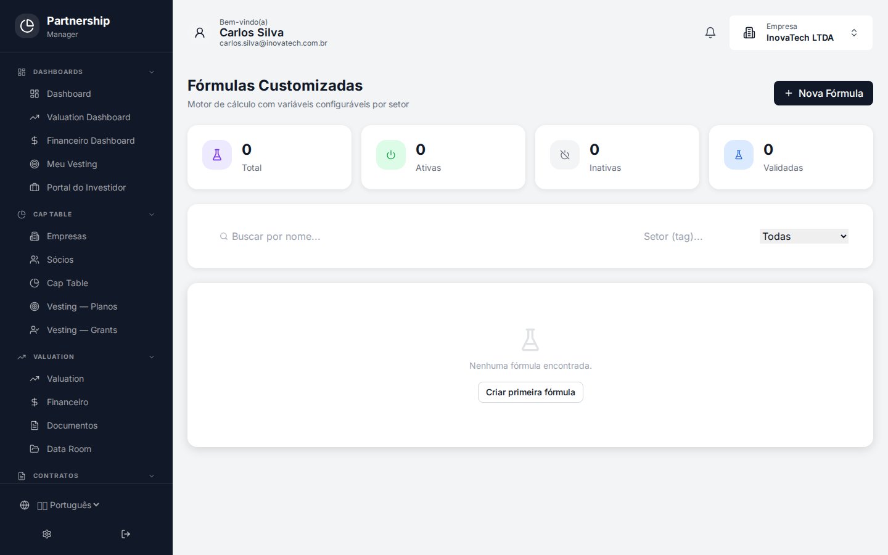

---

### 9.2 Cláusulas

**Rota:** `/contracts/clauses` *(requer perfil Admin ou Legal)*

**Resumo:** Biblioteca centralizada de cláusulas contratuais reutilizáveis para padronizar documentos e facilitar atualizações.

Uma Cláusula é um bloco de texto contratual com título, conteúdo e categoria. Em vez de copiar e colar o mesmo texto em dezenas de contratos, o usuário cria uma cláusula na biblioteca e a referencia nos Templates de Contratos (seção 5.2). Quando a cláusula precisa ser atualizada — por mudança legal, decisão do conselho ou revisão estratégica — a alteração é feita em um único lugar e se propaga automaticamente para todos os templates.

**Funcionalidades disponíveis:**
- **Criar cláusula:** definir título, texto completo e categoria (confidencialidade, não-concorrência, vesting, liquidação, etc.).
- **Marcar como obrigatória:** cláusulas obrigatórias são sempre incluídas nos templates da categoria correspondente, sem possibilidade de remoção pelo criador do contrato.
- **Histórico de versões:** cada edição em uma cláusula gera uma nova versão, mantendo o histórico das versões anteriores para auditoria.
- **Uso nos templates:** ao editar um Template de Contrato (5.2), o usuário pode inserir cláusulas da biblioteca como blocos vinculados.

**Exemplos de cláusulas típicas:**
- Cláusula de confidencialidade (NDA) padrão da empresa.
- Cláusula de non-compete com prazo e abrangência geográfica.
- Cláusula de aceleração de vesting em caso de mudança de controle.
- Cláusula de direito de preferência (ROFR) em transferência de ações.

**Quando usar:** ao revisar uma cláusula recorrente que precisa ser atualizada em contratos futuros; ao padronizar os textos jurídicos usados nos contratos da empresa; ou ao construir uma biblioteca antes de criar os Templates de Contratos.

> **Perfis que utilizam:** Admin, Legal.

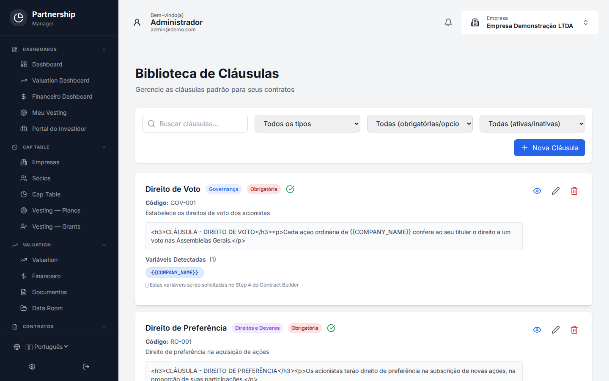

---

### 9.3 Templates de Milestone

**Rota:** `/vesting/milestone-templates` *(requer perfil Admin)*

**Resumo:** Modelos pré-configurados de marcos estratégicos para uso em planos de vesting baseados em eventos.

No vesting por milestone (evento), a aquisição das cotas não ocorre pelo passar do tempo, mas pelo atingimento de marcos estratégicos previamente definidos. Os Templates de Milestone são a biblioteca de marcos disponíveis para seleção ao criar planos de vesting desse tipo.

**Funcionalidades disponíveis:**
- **Criar template de milestone:** definir o nome do marco, descrição detalhada do critério de atingimento, categoria e critérios de validação.
- **Categorização:** organizar milestones por tipo (financeiro, operacional, tecnológico, regulatório) para facilitar a seleção.
- **Uso nos planos de vesting:** ao criar um Plano de Vesting (seção 3.5) com condição de milestone, os templates desta biblioteca ficam disponíveis para seleção, agilizando a configuração.

**Exemplos de milestones típicos:**
- **Financeiro:** "Atingir R$ 1.000.000 de MRR", "Fechar rodada Série A acima de R$ 10M".
- **Operacional:** "Atingir 10.000 usuários ativos", "Lançar o produto em 3 novos mercados".
- **Tecnológico:** "Lançar versão 2.0 da plataforma", "Obter certificação ISO 27001".
- **Pessoal:** "Completar 2 anos na empresa" (marco temporal, mas registrado como milestone).
- **Regulatório:** "Aprovação de patente pelo INPI", "Obtenção de licença de operação".

**Quando usar:** ao estruturar um programa de equity baseado em desempenho, ao criar planos de vesting para executivos com metas atreladas ao crescimento da empresa, ou ao padronizar os marcos antes de criar múltiplos planos de vesting por evento.

> **Perfis que utilizam:** Admin.

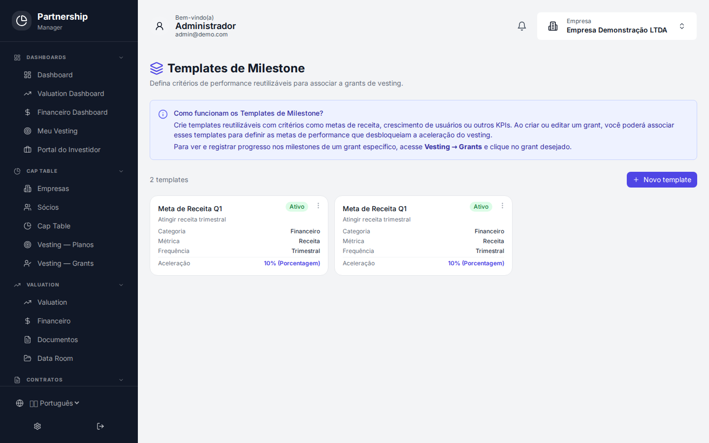

---

## Informações Técnicas

| Item | Detalhe |
|------|---------|
| Plataforma | Web — acesso via navegador moderno (Chrome, Edge, Firefox, Safari) |
| Autenticação | JWT com refresh token — sessão segura e rastreável |
| Permissões | Controle granular por Roles (perfis de acesso) — cada usuário vê apenas o que seu papel permite |
| Dados | Isolamento por empresa (multi-tenant) — nenhuma empresa acessa dados de outra |
| Idioma | Português (BR) |
| Suporte | Para dúvidas ou problemas, entrar em contato com o administrador do sistema |

---

*Documento atualizado em março de 2026.*
